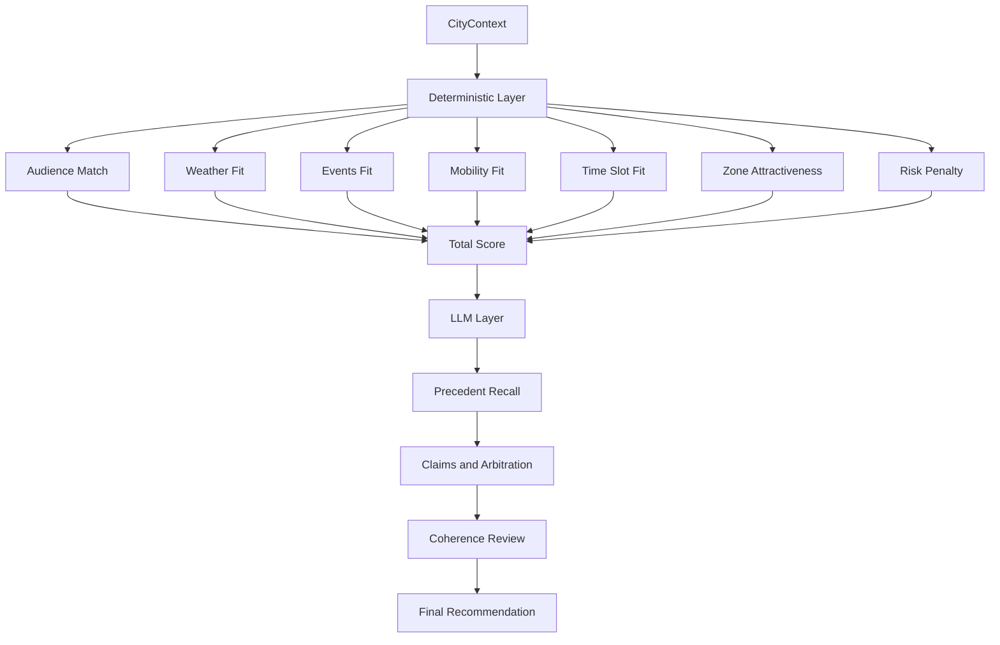
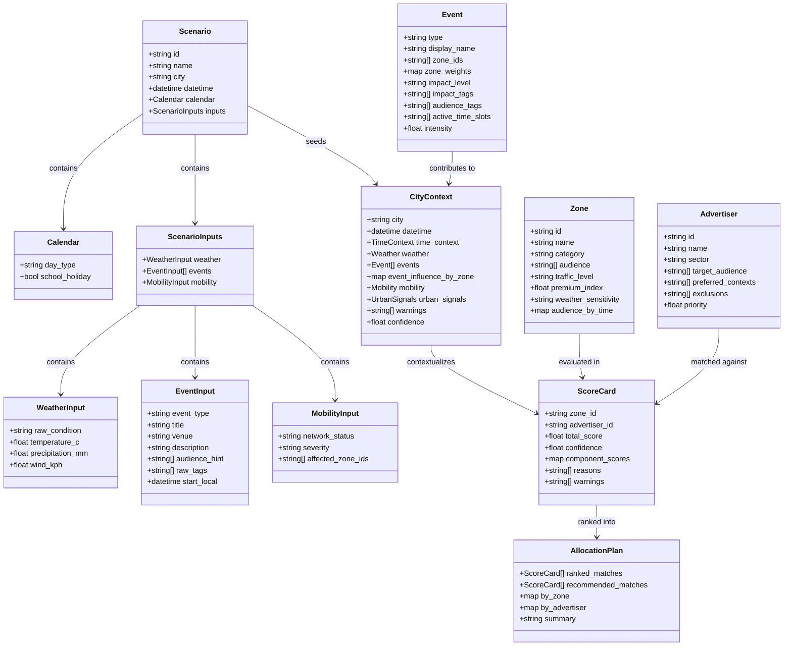

# Architecture

> Les schémas et les blocs Mermaid sont volontairement conservés en anglais (labels proches du code,
> maintenus en un seul exemplaire). Seule la prose est traduite.

## Objectif

Construire un MVP rapide qui démontre une orchestration agentique sur AWS appliquée à un cas d'usage
crédible — l'allocation contextuelle de campagnes publicitaires urbaines — sans cacher la logique de
décision au cœur du LLM.

## Positionnement

- l'**architecture cible** est AWS-native, centrée sur `Bedrock`, `AgentCore Runtime`, `AgentCore Gateway`, `AgentCore Memory`, et un endpoint public sécurisé
- le **runtime local** n'est qu'un chemin de validation, utilisé pour dérisquer la logique métier avant le câblage AWS complet
- le **cœur de décision métier** reste déterministe, inspectable et testable, même entouré de plusieurs agents adossés à des LLM

## Principes

- déterministe d'abord
- LLM uniquement là où le jugement est structurellement requis : revendications, rappel flou, arbitrage, critique
- contrats simples entre étapes
- décisions observables
- infrastructure réversible

## Architecture AWS cible


- `API Gateway` comme point d'entrée HTTP public, auth `AWS_IAM` avec invocation `SigV4`
- `AgentCore Runtime` héberge l'entrypoint `main.py`, qui construit un graphe d'agents Strands par run
- `AgentCore Gateway` expose les cinq tools d'accès aux données en MCP, chacun adossé à un Lambda mince
- `Amazon Bedrock` pour le routage multi-LLM par rôle d'agent
- `AgentCore Memory` (`EPISODIC`) pour l'historique d'allocation et le rappel de précédents
- `S3` pour les données projet, les sorties du harness, et les preuves de replay
- `CloudWatch Logs` pour les traces, warnings, et détails d'exécution
- un harness de scénarios et d'évaluation appelant le **même endpoint déployé** que le flux de démo

Ce que cette vue démontre pour le portfolio : exposition d'un endpoint AWS sécurisé, orchestration
multi-agents, placement multi-LLM délibéré sur Bedrock, raisonnement métier déterministe, replay de
scénarios reproductible via un harness.

Source éditable : [target-aws-architecture.archify.json](docs/diagrams/target-aws-architecture.archify.json)

## Orchestration multi-agents (cible)


Source éditable : [multi-agent-orchestration.archify.json](docs/diagrams/multi-agent-orchestration.archify.json)

### Pourquoi ces rôles, pas davantage

Chaque agent adossé à un LLM n'existe que parce qu'il fait quelque chose qu'une fonction déterministe
ne peut structurellement pas faire. Multiplier les agents pour l'effet démo, sans cette
justification, est traité ici comme un anti-pattern, pas comme une fonctionnalité.

| Rôle | Pourquoi un agent, pas une fonction | Palier modèle | Cycle de vie |
| --- | --- | --- | --- |
| `Events Agent` | classifier des descriptions d'événements brutes et non structurées en signaux métier | small | neuf à chaque run |
| `Advertiser Agent` | revendication locale par annonceur, justifiée par le tool de scoring déterministe (`zone x advertiser`) | small/medium | un rôle générique, instance neuve par annonceur et par run |
| `Precedent Agent` | matching flou entre le scénario courant et des épisodes passés structurellement différents ; une formule à poids fixes ne généralise pas aussi bien. Doit citer les champs structurés matchés (`event_type`, `zone_ids`, `day_type`) et s'abstenir sous un seuil de similarité | small | neuf à chaque run |
| `Campaign Allocator Agent` | une seule passe d'arbitrage global sur toutes les revendications à la fois, pour qu'un conflit de zone local ne soit jamais résolu puis silencieusement annulé par une passe globale séparée | strong | neuf à chaque run |
| `Review Agent` | boucle de critique bornée (1 retry max) pouvant rejeter l'allocation avec un motif — pas une étape de validation passive | strong/medium | neuf à chaque run |

Ce qui reste délibérément **hors** de la couche agent :

- `CityContext Builder` et le tool de scoring (`city_context.py`, `scoring.py` — ce que des versions
  antérieures appelaient `Zone Analyzer` et `Advertiser Matcher`) restent déterministes, pas des agents LLM
- `Weather` et `Mobility` restent des tools Gateway — leurs signaux sont interprétés de façon
  déterministe (seuils de température, mappings d'état réseau), aucun jugement LLM nécessaire
- l'historique brut d'équité par annonceur (gains/refus récents) est une requête Memory déterministe,
  pas un jugement LLM — seul le matching flou inter-scénarios justifie le modèle du `Precedent Agent`

Les paliers de modèle sont indiqués par rôle dans le tableau ci-dessus : placement délibéré selon la
complexité de la tâche et le coût, pas une multiplication de modèles — avec l'appairage de secours
même-palier sur Bedrock décrit plus bas.

### Advertiser Agent : un rôle, pas un agent par annonceur

`_score_advertiser_match(zone, advertiser, city_context)` dans `scoring.py` prend déjà n'importe quel
dict `advertiser` en paramètre — aucun nom d'annonceur n'est codé en dur. L'`Advertiser Agent` suit
la même règle : un rôle/prompt générique unique, instancié dynamiquement une fois par entrée renvoyée
par `get_advertisers()` à l'exécution. Ajouter un 6ᵉ annonceur dans `data/advertisers.json` est un
changement de donnée, pas de code ni de topologie. Le `Graph` Strands construit ses nœuds annonceurs
programmatiquement à partir de cette donnée à chaque run, jamais écrits à la main par nom d'annonceur.

### Isolation : instance neuve par annonceur, par run

`main.py` a déjà un pattern de fabrique pour l'agent de niveau session, indexé par `session_id`, qui
garde délibérément une instance vivante d'un tour à l'autre pour la continuité conversationnelle :

```python
def agent_factory():
    cache = OrderedDict()
    def get_or_create_agent(session_id):
        ...
    return get_or_create_agent
```

Cette continuité est correcte au niveau session et fausse pour l'`Advertiser Agent`. Réutiliser une
même instance `Agent` entre annonceurs dans la boucle ferait fuiter le contexte d'un annonceur dans
la revendication du suivant (Strands accumule l'historique de messages sur une instance réutilisée) ;
cacher par `advertiser_id` entre deux runs ferait fuiter du contexte entre scénarios sans lien. La
règle est donc :

- une instance `Agent` neuve par annonceur, à chaque itération de boucle, jamais réutilisée entre annonceurs
- aucun cache indexé par `advertiser_id` entre deux runs — le graphe entier est reconstruit par scénario
- aucune API de « reset » à penser à appeler — créer un nouvel `Agent` Strands est peu coûteux, donc
  on jette et on recrée plutôt que d'essayer de vider un objet à état

### Exécution parallèle

Les revendications des annonceurs sont indépendantes par construction — cette indépendance est
précisément la raison pour laquelle un unique `Campaign Allocator Agent` global résout les conflits
ensuite, plutôt qu'une négociation séquentielle. Le `Graph` Strands exécute les branches sans arête
de dépendance entre elles de façon concurrente, donc le fan-out d'`Advertiser Agent` tourne en
parallèle. C'est sûr précisément parce que chaque annonceur reçoit une instance neuve et indépendante
— réutiliser une instance partagée entre appels parallèles serait une race condition, pas juste une
fuite de contexte.

Deux décisions prises explicitement, pas par défaut :

- **Débit Bedrock** : N appels modèle concurrents augmentent la charge simultanée ; acceptable aux 5
  annonceurs actuels, à surveiller côté provisioned throughput si le nombre d'annonceurs grandit
- **Politique d'échec partiel** : dégradation gracieuse — si un advertiser agent échoue, l'Allocator
  poursuit avec N-1 revendications plus un warning explicite, cohérent avec le champ `warnings`
  existant sur `ScoreCard` / `CityContext`, plutôt que de faire échouer tout le run. Même politique
  si le `Precedent Agent` échoue ou s'abstient : arbitrer sans précédent, plus un warning

### Chaîne de résilience pour un appel modèle en échec

Repli ordonné, chaque étape n'étant déclenchée que lorsque la précédente est épuisée :

1. **Retry avec backoff exponentiel et jitter, même modèle** — 2 tentatives max. Pas un retry
   immédiat : comme les advertiser agents tournent en parallèle, un retry immédiat sur une erreur de
   throttling resynchroniserait les N agents sur le même instant de retry et reproduirait le même
   throttling un instant plus tard (retry storm). Le jitter les décale.
2. **Modèle de secours, même palier, même provider Bedrock** — couvre une panne spécifique à un
   modèle ou un quota de débit par modèle, que réessayer le même modèle ne corrige pas. L'appairage
   principal/secours par rôle est fixé explicitement (small vers small), jamais un « n'importe quel
   modèle disponible » ad hoc, pour éviter de basculer silencieusement sur un modèle plus fort et plus
   cher. Le modèle qui a réellement servi chaque requête est loggé — décisions observables.
3. **Repli heuristique déterministe, dernier recours** — le pattern déjà utilisé par `Events Agent`
   (mode LLM avec repli heuristique), appliqué partout : si le modèle de secours échoue aussi, utiliser
   le score déterministe brut sans justification rédigée par LLM, marqué d'un warning explicite. Le
   pipeline ne casse jamais complètement sur une panne modèle isolée.

### Chemin d'écriture en Memory

- un épisode par run, écrit par le post-hook uniquement après approbation du Review
- chaque épisode est tagué `scenario_id` et `source: demo | harness`
- le rappel de précédents exclut les épisodes `harness` et déduplique par `scenario_id`, pour que le
  replay de scénarios ne puisse pas noyer le matching de similarité ni fausser les compteurs d'équité

## Flux d'une requête


Clés de lecture :

- les données de contexte passent toujours par le Gateway (MCP), jamais par des appels directs aux providers
- `CityContext` et le scoring déterministe sont calculés en-process avant toute revendication
- les revendications des annonceurs se déploient en parallèle sur le palier small ; arbitrage et review tournent sur le palier strong
- l'étape de review peut rejeter le plan exactement une fois avant que la réponse ne soit renvoyée

Source éditable : [request-flow.archify.json](docs/diagrams/request-flow.archify.json)

## Surface de tools Gateway

| Tool | Backend | Consommé par |
| --- | --- | --- |
| `get_weather` | Open-Meteo, repli mock | `CityContext Builder` (interprétation déterministe) |
| `get_events` | Paris Open Data, repli mock | `Events Agent` (classification LLM) |
| `get_mobility` | forecast hour-of-week, repli mock | `CityContext Builder` (interprétation déterministe) |
| `get_zones` | S3 / `data/zones.json` | tool de scoring |
| `get_advertisers` | S3 / `data/advertisers.json` | boucle d'instanciation de l'`Advertiser Agent` |

Les tools récupèrent ou normalisent des signaux bruts ; l'interprétation a lieu en aval. Les contrats
sont conçus pour survivre sans changement à la transition des providers mock locaux vers l'exposition
`AgentCore Gateway` :

- [docs/GATEWAY_TOOLS.md](docs/GATEWAY_TOOLS.md)
- [tools/gateway_tool_contracts.json](tools/gateway_tool_contracts.json)

## Séparation des décisions



La discipline de raisonnement, dans l'ordre : contexte d'abord, scoring déterministe ensuite, puis
revendications LLM, arbitrage et review. L'influence multi-événements est agrégée par zone avant le
scoring. Le MVP ne saute jamais des signaux bruts à une réponse LLM-only — cette séparation est
centrale pour la valeur portfolio : le système montre du contrôle architectural, pas juste du
prompting de modèle.

## Modèle de données



Le choix de conception important : `CityContext` est l'unique objet normalisé consommé par tout le
raisonnement en aval. Cela garde les composants faiblement couplés et rend les tests bien plus simples.

## Contrats de base

### Entrée

```json
{
  "city": "Paris",
  "datetime": "2026-07-08T18:30:00+02:00",
  "scenario_id": "concert_bercy"
}
```

### CityContext

Voir [tools/city_context.example.json](tools/city_context.example.json).

### Sortie

- résumé de contexte global
- allocation par annonceur
- allocation par zone
- score et confiance
- explication technique courte
- résumé exécutif (distinct de l'explication technique)
- journal d'exécution

## Hooks

### Pre-hook

- valider l'entrée
- normaliser la datetime, dériver le time slot, calculer le `TimeContext`
- créer les métadonnées d'exécution initiales

### Post-hook

- valider la forme de la réponse
- ajouter confiance et warnings
- appliquer le disclaimer « pas d'inventaire réel »

## Raisonnement multi-événements

Implémenté aujourd'hui :

- plusieurs événements coexistent dans un même workflow, chacun avec poids de zone, intensité, et time slots préférés
- `CityContext Builder` agrège ces signaux dans `event_influence_by_zone`
- le scoring de zone consomme cette influence agrégée au lieu d'un flag événement binaire

Volontairement non implémenté dans le MVP :

- calcul de rayon géospatial à partir de coordonnées réelles
- arbitrage de conflit d'événements par capacité de lieu ou forecast de trafic
- chevauchement temporel fin via datetimes de début et de fin
- raisonnement causal inter-événements avec les forecasts de mobilité

## Harness et chemin de validation

Le POC expose un unique point d'entrée déployé, utilisé par deux flux compatibles :

- `demo flow` : un recruteur ou un opérateur lance un scénario connu et inspecte la recommandation
- `harness flow` : le replay de scénarios et une évaluation légère frappent le même endpoint pour
  vérifier la forme de sortie, la cohérence du raisonnement, et le comportement des warnings

Cela prouve que le déploiement n'est pas un script de démo one-shot : l'endpoint est sollicité de
façon reproductible et le workflow agentique reste observable et explicable à travers les scénarios.

## Chemin de validation local

Le runtime local n'est pas l'architecture cible. Il existe pour valider la logique avant l'intégration
AWS complète, en préservant une itération rapide sur la conception des scénarios, les contrats de
tools, le comportement du scoring déterministe, la structure de sortie, et la sémantique des garde-fous.

Moteur local actuel :

- `src/urban_campaign_intelligence/pre_hook.py`
- `src/urban_campaign_intelligence/context_agents.py`
- `src/urban_campaign_intelligence/city_context.py`
- `src/urban_campaign_intelligence/scoring.py`
- `src/urban_campaign_intelligence/review.py`
- `src/urban_campaign_intelligence/runner.py`

Il exécute le même cœur de raisonnement métier sans dépendances AWS, pour une itération rapide sur
scénarios et régressions et comme mode dev de repli pendant le câblage du runtime AWS. Ce n'est ni
l'architecture cible ni la preuve principale de capacité agentique AWS — c'est le chemin AWS qui l'est.

## Cartographie de portabilité

### Correspondance local vers cible AWS

| Composant local | Rôle actuel | Cible Bedrock / AgentCore |
|---|---|---|
| `runner.py` | orchestrateur local | entrypoint runtime construisant le graphe d'agents Strands |
| `pre_hook.py` | validation d'entrée et `TimeContext` | pre-hook |
| `gateway_tools.py` | providers mock/semi-réels | tools AgentCore Gateway (targets Lambda) |
| `context_agents.py` | classification LLM des events + interprétation déterministe weather/mobility | `Events Agent` sur Bedrock + étapes déterministes |
| `city_context.py` | fusion de contexte déterministe | builder déterministe, en-process |
| `scoring.py` | couche de décision déterministe | tool de scoring déterministe partagé |
| `review.py` | review finale et warnings | `Review Agent` + post-hook |
| `data/*.json` | dépôts locaux | objets S3 derrière `get_zones` / `get_advertisers` |
| historique d'allocation (aucun encore) | — | AgentCore Memory (`EPISODIC`) |

### Ce qui reste stable pendant le portage

- les contrats de tools
- la forme de `CityContext`
- la logique de scoring déterministe
- le modèle de données zones et annonceurs
- la structure de sortie orientée explication

### Ce qui change pendant le portage

- les appels de fonctions Python directs entre composants
- l'intégration runtime spécifique à OpenRouter
- le câblage des variables d'environnement locales
- le flux d'orchestration local dans `runner.py`

### Séquence de migration

1. préserver les contrats existants
2. déplacer les providers d'accès aux données derrière des tools Gateway
3. déplacer les agents adossés à un LLM vers des modèles Bedrock
4. déplacer l'orchestration vers le graphe d'agents Strands sur AgentCore
5. attacher AgentCore Memory pour les épisodes d'allocation
6. garder le scoring déterministe hors de la couche LLM à chaque étape

### Anti-pattern à éviter

Ne pas ré-encoder la couche métier déterministe dans des prompts pendant le portage. Si cela arrive,
la portabilité se dégrade, les tests s'affaiblissent, et l'architecture perd l'une de ses forces principales.

## État d'implémentation

Implémenté localement :

- pipeline déterministe de bout en bout : pre-hook, builder `CityContext`, scoring zone/annonceur, allocation, review, runner CLI, smoke tests
- modes LLM d'`Events Agent` et `Review Agent` avec repli heuristique (OpenRouter pour la validation locale)
- providers semi-réels avec repli mock : Open-Meteo (météo), Paris Open Data (événements), forecast hour-of-week (mobilité)
- contrats de tools Gateway formalisés et consommés localement

Pas encore sur AWS :

- endpoint protégé `AWS_IAM`, câblage AgentCore Runtime, AgentCore Gateway, AgentCore Memory
- graphe multi-agents (Advertiser / Precedent / Allocator / Review) sur des modèles Bedrock
- harness contre l'endpoint déployé

Suivi détaillé : [docs/STATUS.md](docs/STATUS.md)

## Cartographie AWS

### MVP

- Bedrock / AgentCore pour l'orchestration et les appels modèle
- AgentCore Gateway pour les tools d'accès aux données utilisés par les agents
- AgentCore Memory pour l'historique d'allocation
- Bash + AWS CLI + AgentCore CLI pour le déploiement
- région unique, choisie pour qu'AgentCore et chaque paire de modèles principal/secours y soient tous disponibles

### Garde-fous coût et IAM

- budget alarm sur le compte de démo ; usage plan API Gateway avec rate limiting
- plafond dur du total d'appels modèle par requête (fan-out × retries × redo de review inclus) ; `max_tokens` borné par rôle
- un identifiant de corrélation `run_id` propagé Runtime → Gateway → Lambdas → logs Bedrock — décisions observables de bout en bout

| Principal | Portée |
| --- | --- |
| appelant demo / harness | `execute-api:Invoke` sur la route de démo uniquement |
| rôle runtime | `bedrock:InvokeModel` sur les model ids autorisés, invoke Gateway, read/write Memory |
| rôles Lambda tools | un rôle par tool ; S3 read-only là où nécessaire |

### Plus tard

- Terraform ou OpenTofu
- CI/CD
- observabilité plus riche
- intégrations de données externes réelles

## Frontières de l'architecture

- pas de source d'inventaire réelle
- pas de SLA de production
- pas de persistance complexe au-delà des épisodes AgentCore Memory
- pas de dépendance frontend avancée
