# Document d'Architecture Technique

### Urban Campaign Intelligence — MVP portfolio

| | |
| --- | --- |
| **Version** | `v1.0` |
| **Date** | 2026-07-21 |
| **Auteur** | ClementV78 |
| **Statut** | 🟡 Architecture cible **arrêtée** — implémentation **partielle** (voir [§12 Trajectoire](#12-trajectoire)) |
| **Périmètre** | Cible AWS / AgentCore, répartition des responsabilités, décisions structurantes |
| **Audience** | Propriétaire du repo · reviewer technique · interviewer Cloud / AI Architect |
| **Région AWS** | `us-east-1` (mono-région) |

> **Nature du document** — DAT *light* orienté MVP portfolio.
> Les schémas et labels techniques restent en anglais pour rester alignés avec le code et les outils.

<b>Historique des versions</b>

 

| Version | Date | Auteur | Nature de la modification |
| :--- | :--- | :--- | :--- |
| `v1.0` | 2026-07-21 | ClementV78 | Alignement sur la cible AgentCore / Strands, mise au format DAT |

---

## Sommaire

- [1. Objet du document](#1-objet-du-document)
- [2. Contexte et objectif](#2-contexte-et-objectif)
- [3. Principes d'architecture](#3-principes-darchitecture)
- [4. Périmètre fonctionnel](#4-périmètre-fonctionnel)
- [5. Architecture cible](#5-architecture-cible)
  - [5.1 Vue AWS cible](#51-vue-aws-cible)
  - [5.2 Vue d'orchestration](#52-vue-dorchestration)
  - [5.3 Flux d'exécution cible](#53-flux-dexécution-cible)
- [6. Répartition des responsabilités](#6-répartition-des-responsabilités)
  - [6.1 AgentCore](#61-agentcore)
  - [6.2 Strands](#62-strands)
  - [6.3 Code métier du projet](#63-code-métier-du-projet)
- [7. Surface de tools cible](#7-surface-de-tools-cible)
- [8. Sécurité et garde-fous](#8-sécurité-et-garde-fous)
  - [8.1 Principe général](#81-principe-général)
  - [8.2 Identité et contrôle d'accès](#82-identité-et-contrôle-daccès)
  - [8.3 Répartition des contrôles](#83-répartition-des-contrôles)
- [9. Modèle de données et logique métier](#9-modèle-de-données-et-logique-métier)
- [10. Exigences non fonctionnelles](#10-exigences-non-fonctionnelles)
- [11. Observabilité et exploitation](#11-observabilité-et-exploitation)
- [12. Trajectoire](#12-trajectoire)
- [13. Décisions d'architecture retenues](#13-décisions-darchitecture-retenues)
- [14. Risques et mitigations](#14-risques-et-mitigations)
- [15. Points ouverts](#15-points-ouverts)
- [16. Hypothèses, limites et hors périmètre](#16-hypothèses-limites-et-hors-périmètre)
- [17. Documents associés](#17-documents-associés)

## 1. Objet du document

Ce document décrit l'architecture cible du MVP **Urban Campaign Intelligence**.

Son objectif est de fixer :

- la **cible AWS / AgentCore** à atteindre
- la **répartition des responsabilités** entre AgentCore, Strands et code métier
- les **décisions structurantes** retenues pour le MVP
- l'**écart entre l'état actuel et la cible**

Ce document n'est pas un runbook de déploiement ni une spécification détaillée de chaque composant.
Les détails d'implémentation, d'infrastructure et de suivi restent dans :

- [docs/STATUS.md](docs/STATUS.md) — état réel du repo
- [docs/RUNBOOK_DEPLOY.md](docs/RUNBOOK_DEPLOY.md) — procédures de déploiement
- [docs/RUNTIME_MAPPING.md](docs/RUNTIME_MAPPING.md) — mapping des composants réels sur la cible
- [docs/DECISIONS.md](docs/DECISIONS.md) — ADRs

## 2. Contexte et objectif

Le projet est un **MVP de démonstration**. Il doit montrer de manière crédible :

- une orchestration agentique sur AWS
- une intégration sérieuse avec **Amazon Bedrock AgentCore**
- une séparation claire entre **raisonnement LLM** et **logique métier déterministe**
- une architecture simple, explicable, déployable rapidement

Le cas d'usage est l'allocation contextuelle de campagnes publicitaires urbaines à partir d'un contexte
ville construit dynamiquement.

Le projet ne vise pas :

- un produit de production complet
- une plateforme adtech exhaustive
- une optimisation temps réel sur inventaire réel

## 3. Principes d'architecture

Les principes suivants gouvernent les choix du MVP :

- **Deterministic first** : le scoring et l'allocation critique restent lisibles, testables et hors prompt
- **Agentic where it matters** : le LLM décide des tool calls et produit les arbitrages qui nécessitent un jugement
- **AWS where it adds value** : chaque composant AWS doit renforcer la démonstration, pas décorer l'architecture
- **Governed tools** : les accès aux données de contexte passent par une surface contrôlée
- **Observable execution** : tool calls, warnings, fallbacks et décisions critiques doivent être traçables
- **MVP discipline** : pas de composants annexes lourds tant qu'ils n'apportent pas de valeur démonstrative claire

## 4. Périmètre fonctionnel

Le workflow cible traite une requête de recommandation de campagne sur une ville et un instant donnés.

À haut niveau, le système doit :

1. recevoir une requête de recommandation
2. laisser l'agent récupérer le contexte utile via des tools gouvernés
3. construire un `CityContext` normalisé
4. exécuter un scoring déterministe zones × annonceurs
5. arbitrer et reviewer le résultat avec des agents LLM ciblés
6. renvoyer une recommandation explicable avec scores, confiance et warnings

Le contrat d'entrée / sortie et les structures associées sont décrits dans
[docs/RUNTIME_MAPPING.md](docs/RUNTIME_MAPPING.md).
Un exemple de contexte normalisé est disponible dans
[tools/city_context.example.json](tools/city_context.example.json).

## 5. Architecture cible

Les schémas de ce chapitre sont les schémas **canoniques** du projet. Les autres schémas présents dans
[docs/diagrams/](docs/diagrams/) sont historiques et ne font pas foi ; la règle est posée dans
[docs/diagrams/README.md](docs/diagrams/README.md).

### 5.1 Vue AWS cible

Source éditable : [target-aws-architecture.archify.json](docs/diagrams/target-aws-architecture.archify.json)

#### 5.1.1 Lecture de la cible

- `InvokeAgentRuntime` est le **point d'entrée principal** du MVP
- `AgentCore Runtime` héberge l'application runtime et l'entrypoint `main.py`
- un **Strands agent métier** est instancié dans le runtime pour orchestrer la requête
- `AgentCore Gateway` expose les tools de contexte avec gouvernance centralisée
- `Amazon Bedrock` fournit les modèles utilisés par les rôles agentiques
- `S3` sert de dépôt simple pour les données projet et les artefacts de replay
- `CloudWatch Logs` centralise les traces d'exécution
- `API Gateway` reste **optionnel** comme façade HTTP si la démo en a besoin
- `AgentCore Memory` reste **optionnel** et n'est introduit que si la démonstration inter-run le justifie

#### 5.1.2 Décision structurante

La cible retenue est un modèle **hybride** :

- le **LLM décide des tool calls**
- les **tools** ne font que récupérer et normaliser des signaux
- le **code déterministe** garde la main sur `CityContext`, le scoring et les garde-fous métier

La décision métier critique reste donc hors prompt et testable indépendamment de la couche agentique.

### 5.2 Vue d'orchestration

Source éditable : [multi-agent-orchestration.archify.json](docs/diagrams/multi-agent-orchestration.archify.json)

#### 5.2.1 Rôles retenus

| Rôle | Type | Responsabilité |
| --- | --- | --- |
| `UrbanCampaignStrandsAgent` | agent d'orchestration | pilote la requête, décide des tool calls, orchestre les étapes |
| `Events Agent` | agent spécialisé | interprète des événements bruts en signaux métier exploitables |
| `Advertiser Agent` | agent spécialisé | formule des revendications argumentées par annonceur |
| `Campaign Allocator Agent` | agent spécialisé | arbitre globalement les revendications |
| `Review Agent` | agent spécialisé | critique la sortie finale et peut déclencher un rejet borné |
| `CityContext Builder` | code déterministe | normalise les signaux bruts en `CityContext` |
| `Scoring Engine` | code déterministe | calcule les scores et garde une explicabilité forte |

À ce jour, seuls `Events Agent`, `Review Agent` et la synthèse exécutive ont un étage LLM
réel (chacun avec repli heuristique). `Advertiser Agent` et `Campaign Allocator Agent` sont des
cibles : l'arbitrage est aujourd'hui porté par le scoring déterministe. Le code comporte en outre
un agent météo et un agent mobilité, non représentés ici car purement normalisateurs.

#### 5.2.2 Règle de conception

Un agent n'est introduit que si la tâche nécessite un jugement probabiliste, un arbitrage ou une
reformulation que du code déterministe gérerait mal. Le reste reste hors couche agentique.

### 5.3 Flux d'exécution cible

Source éditable : [request-flow.archify.json](docs/diagrams/request-flow.archify.json)

#### 5.3.1 Séquence cible simplifiée

1. le client appelle `InvokeAgentRuntime`
2. le runtime instancie l'agent Strands du run
3. l'agent décide d'appeler les tools utiles via `AgentCore Gateway`
4. les tools récupèrent météo, événements, mobilité et données de référence
5. le code métier construit `CityContext`
6. le moteur déterministe calcule scores et recommandations candidates
7. les agents d'arbitrage et de review interviennent si nécessaire
8. la réponse finale est validée, enrichie de warnings/disclaimers puis renvoyée

## 6. Répartition des responsabilités

### 6.1 AgentCore

AgentCore est responsable de :

- l'hébergement du runtime
- le protocole d'invocation du runtime
- l'exposition gouvernée des tools via Gateway
- l'application des policies et guardrails de plateforme
- la collecte de traces et métadonnées d'exécution

### 6.2 Strands

Strands est le **SDK par défaut** de la couche agentique et de l'accès modèle. Il est responsable de :

- la boucle agentique
- la décision d'appeler ou non un tool
- le séquencement des rôles agentiques
- la coordination de la requête jusqu'à la réponse
- l'**accès aux modèles Bedrock** via `BedrockModel` (transport Converse, retries, guardrails)
- l'**extraction structurée** via `Agent.structured_output`, contrainte par des schémas Pydantic

Règle : du code custom n'est écrit que là où le SDK ne couvre pas le besoin. À ce jour, une seule
exception subsiste — la cascade de repli décrite au §6.3.

### 6.3 Code métier du projet

Le code métier du projet reste responsable de :

- la validation et normalisation d'entrée
- la construction de `CityContext`
- la logique de scoring
- l'allocation déterministe
- les warnings métier
- les disclaimers
- les fallbacks explicites

Il porte aussi la **cascade de repli** `Bedrock → OpenRouter → heuristique déterministe`. Strands
ne fournit pas de notion de dégradation hors LLM : c'est une décision d'architecture (ADR-007), pas
un contournement du SDK.

#### 6.3.1 Contrainte de conception

Le scoring et les règles métier ne sont pas déplacés dans des prompts. Cette contrainte est
structurante pour la cible et conditionne la testabilité du système (voir ADR-002 dans
[docs/DECISIONS.md](docs/DECISIONS.md)).

Deux motifs distincts justifient donc le code custom, à ne pas confondre :

| Motif | Exemple | Statut |
| --- | --- | --- |
| le SDK ne couvre pas le besoin | cascade de repli inter-fournisseurs | à réévaluer si Strands l'offre un jour |
| on veut **délibérément** rester hors LLM | scoring, allocation, `CityContext` | **non négociable** (ADR-002) |

## 7. Surface de tools cible

Les tools de contexte sont exposés via `AgentCore Gateway`.

**Cible** : appeler des APIs réelles par défaut, les mocks ne servant que de fallback offline et de
mécanisme de résilience.

**État actuel** : les providers sont en `mock` par défaut (`WEATHER_PROVIDER`, `EVENTS_PROVIDER`) et
`forecast` pour la mobilité. Le mode live dégrade explicitement et pose un warning quand aucune source
réelle n'a répondu ; il ne fabrique pas de contexte.

| Tool | Rôle | Backend cible | Fallback |
| --- | --- | --- | --- |
| `get_weather` | récupérer la météo courante / proche | API météo publique | cache + mock |
| `get_events` | récupérer les événements urbains | open data | cache + mock |
| `get_mobility` | récupérer un signal de mobilité | forecast dérivé | cache + mock |
| `get_zones` | lire les zones de démonstration | S3 / JSON | — |
| `get_advertisers` | lire les annonceurs de démonstration | S3 / JSON | — |

Seuls `get_weather`, `get_events` et `get_mobility` sont contractualisés à ce jour dans
[tools/gateway_tool_contracts.json](tools/gateway_tool_contracts.json). `get_zones` et
`get_advertisers` restent des lectures de données directes : leur passage en tools est une cible.

Références :

- [docs/GATEWAY_TOOLS.md](docs/GATEWAY_TOOLS.md)
- [tools/gateway_tool_contracts.json](tools/gateway_tool_contracts.json)

### 7.1 Règle de gouvernance

Les tools sont des **surfaces d'accès gouvernées**, pas des morceaux de logique métier.

Ils portent :

- authn / authz
- policy enforcement
- request / response guardrails
- traces d'appel
- erreurs normalisées

Le wrapper d'exécution (Lambda ou autre service léger) n'est pas figé et n'est pas une décision
structurante : la gouvernance est portée par Gateway, pas par le backend.

## 8. Sécurité et garde-fous

> **État actuel — contrôles à matérialiser.** Ce chapitre décrit le modèle de sécurité **cible**.
> Le runtime AgentCore déployable est aujourd'hui minimal : `networkMode: PUBLIC`, `protocol: HTTP`,
> et `agentCoreGateways`, `policyEngines`, `memories` vides dans `agentcore.json`. Aucun des contrôles
> de plateforme ci-dessous (Gateway gouverné, Policy, Guardrails) n'est encore câblé. La séquence de
> matérialisation est au [§12.2](#12-trajectoire).

### 8.1 Principe général

Les contrôles génériques sont couverts en priorité par les mécanismes AWS natifs, et non
réimplémentés dans le code applicatif.

### 8.2 Identité et contrôle d'accès

#### 8.2.1 Auth inbound

L'appel de `InvokeAgentRuntime` est authentifié par **IAM / SigV4**. C'est la surface d'entrée
primaire du MVP.

`API Gateway` reste une façade HTTP optionnelle, pas le point d'entrée principal. La v1 n'introduit
aucune dépendance obligatoire à Cognito, OIDC ou JWT.

#### 8.2.2 Auth outbound

Le pattern retenu est l'**outbound auth natif de Gateway** :

- backend AWS → IAM
- API tierce → credential provider / token vault / secret adapté au backend

Un **interceptor** n'est introduit que si l'injection dynamique de headers est nécessaire (override,
refresh, enrichissement). Il n'est pas le mécanisme d'authentification par défaut.

Le détail d'implémentation par tool n'est pas figé à ce stade (voir [15. Points ouverts](#15-points-ouverts)).

### 8.3 Répartition des contrôles

#### 8.3.1 Contrôles de plateforme

- **Bedrock Guardrails** pour les protections génériques sur contenu et fuites
- **Policy in AgentCore** pour l'application des contrôles sur la surface runtime / gateway
- **AgentCore Gateway** pour la gouvernance des tools et des accès
- **interceptors Gateway** pour journaliser, borner et contrôler les appels de tools

#### 8.3.2 Contrôles applicatifs

Les hooks applicatifs restent centrés sur :

- la validation du format d'entrée
- la readiness métier
- la cohérence des données minimales attendues
- la présence des disclaimers de sortie
- la production de warnings explicites

#### 8.3.3 Position retenue

Le filtrage générique de motifs d'injection (`ignore previous instructions` et équivalents) n'est pas
réimplémenté en code custom : il relève des mécanismes de plateforme. Le code applicatif garde les
contrôles métier, la plateforme garde les contrôles génériques.

## 9. Modèle de données et logique métier

Le modèle métier pivot est `CityContext`.

Il concentre :

- les signaux météo
- les signaux événements
- les signaux mobilité
- le contexte temporel
- les warnings
- la confiance globale

La logique métier suit la chaîne suivante :

1. récupération des signaux bruts
2. normalisation dans `CityContext`
3. scoring déterministe par zone et annonceur
4. arbitrage LLM borné
5. review et enrichissement de la réponse

Le détail des structures et classes est documenté dans
[docs/RUNTIME_MAPPING.md](docs/RUNTIME_MAPPING.md).

## 10. Exigences non fonctionnelles

Les valeurs ci-dessous sont des **hypothèses de dimensionnement MVP portfolio**, pas des engagements
de service. Aucun SLA n'est contracté (voir [16. Hypothèses, limites et hors périmètre](#16-hypothèses-limites-et-hors-périmètre)).

| Exigence | Cible MVP | Commentaire |
| --- | --- | --- |
| Latence bout-en-bout | < 10 s souhaité, 10–20 s acceptable | contrainte forte sur le nombre de rôles LLM enchaînés et de tool calls séquentiels |
| Concurrence | 1 à 5 runs simultanés | usage démonstration, pas de montée en charge |
| Coût d'exploitation | quelques dizaines d'euros / mois maximum | dominé par la consommation Bedrock et les invocations runtime |
| Disponibilité | best effort, mono-région | pas de redondance multi-AZ ni multi-région gérée par le projet |
| Volumétrie | 20 zones, 5 annonceurs | périmètre figé par ADR-003 |
| Résilience des tools | dégradation contrôlée | échec d'un tool → fallback explicite + warning, jamais d'échec silencieux |

Le budget de latence est le point de tension principal : chaque rôle agentique ajouté consomme
directement sur l'enveloppe des 10 s. C'est un critère de refus pour tout nouvel agent.

## 11. Observabilité et exploitation

Le MVP rend visibles au minimum :

- le `run_id` de corrélation
- la durée de chaque étape et la durée totale
- le fournisseur, le modèle et les tokens consommés par étape LLM
- les tools appelés
- les succès / échecs / fallbacks de tools
- les warnings produits
- le modèle utilisé pour chaque étape LLM critique
- la forme de sortie finale

Chaque run porte un **`run_id`** propagé sur toutes les entrées de l'`execution_log`, et chaque étape
est horodatée (`t_ms`, `elapsed_ms`). Le bloc `run` de la réponse résume identifiant, mode, nombre
d'étapes, durée totale et tokens consommés — ce qui rend le budget de latence du §10 **mesurable**.

Les entrées sont émises comme **logs structurés JSON** via le module `logging` standard, en plus
d'être présentes dans la réponse. C'est ce qui permettra leur reprise par CloudWatch Logs une fois le
pipeline hébergé dans AgentCore Runtime, sans réécriture.

Le parcours d'une requête est reconstituable visuellement : `--trace` produit une frise ASCII des
durées par étape, `--trace-mermaid` un diagramme de séquence Mermaid collable dans un document.

La traçabilité des hooks déclenchés et des permissions effectives reste une **exigence cible** : elle est spécifiée ici mais n'est pas encore implémentée. La rétention des
logs et l'alerting ne sont pas définis à ce stade et relèvent de
[docs/RUNBOOK_DEPLOY.md](docs/RUNBOOK_DEPLOY.md).

## 12. Trajectoire

L'architecture cible décrite dans ce document est arrêtée. L'implémentation est partielle.

L'état détaillé du repo fait référence dans [docs/STATUS.md](docs/STATUS.md) ; la comparaison
visuelle existant / cible est archivée dans
[docs/archive/2026-07-aws-existant-vs-cible.md](docs/archive/2026-07-aws-existant-vs-cible.md).
Le présent chapitre n'en donne que la synthèse.

### 12.1 Écart principal à date

Le moteur local implémente un routage et un pipeline métier déterministe. La boucle agentique Strands
pilotant les tool calls de bout en bout n'est pas implémentée, et la surface Gateway n'est pas câblée
sur les tools de contexte.

La couche modèle passe par le **SDK Strands** (`BedrockModel` + `Agent.structured_output`,
ADR-007), avec OpenRouter en repli transitoire destiné à être retiré. Les contrats de sortie LLM
sont des schémas Pydantic (`llm_schemas.py`), validés quel que soit le fournisseur. Sans fournisseur
configuré, chaque étage LLM dégrade vers son heuristique déterministe. Les providers de contexte
restent en `mock` par défaut.

### 12.2 Séquence de matérialisation

Le critère de **« MVP AWS done »** est une **seule verticale fermée**, pas une couverture large :

> `InvokeAgentRuntime` → 1 agent Strands → 1 tool via Gateway → noyau déterministe → réponse explicable.

Tant que cette verticale n'est pas fermée de bout en bout, le reste (multi-tools, Memory, façade HTTP)
est explicitement **post-MVP**. Ordre de matérialisation :

1. **verticale locale fermée** — entrypoint AgentCore branché sur le noyau métier, testable via
   `app.run()` sans dépendre de Bedrock (le pipeline dégrade en déterministe). *← marche courante*
2. agent Strands pilotant réellement les tool calls, sur Bedrock débloqué
3. un premier tool de contexte exposé via `AgentCore Gateway`, puis les suivants
4. contrôles AgentCore / Guardrails / Policy effectivement câblés
5. observabilité d'exécution alignée avec le chapitre 11

Les étapes 2 à 4 sont conditionnées à deux blocages compte AWS : accès Bedrock et quota
`AWS::BedrockAgentCore::Runtime` (voir [docs/STATUS.md](docs/STATUS.md)).

## 13. Décisions d'architecture retenues

Les décisions et leur justification font référence dans [docs/DECISIONS.md](docs/DECISIONS.md).
Le tableau ci-dessous en est l'index de lecture architecture.

| Sujet | Décision | ADR |
| --- | --- | --- |
| Entrée MVP | `InvokeAgentRuntime` | — |
| Auth inbound | IAM / SigV4 | — |
| Façade HTTP | `API Gateway` optionnel | — |
| Modèle d'orchestration | agent Strands dans AgentCore Runtime (« option 2 ») | ADR-004, ADR-006 |
| Tool calling | décidé par l'agent | — |
| Logique métier critique | déterministe et hors prompt | ADR-002 |
| Surface de tools | `AgentCore Gateway` | — |
| Backends de tools | APIs réelles par défaut, mock en fallback | — |
| Sécurité générique | Guardrails + Policy + Gateway | — |
| Auth outbound | outbound auth natif Gateway, interceptor si besoin dynamique | — |
| Contrôles métier | hooks applicatifs légers | — |
| SDK agentique et accès modèle | Strands (`BedrockModel`, `structured_output`) par défaut | ADR-007 |
| Fournisseur de modèles | Bedrock ; OpenRouter transitoire, à retirer | ADR-007 |
| Persistance mémoire | `AgentCore Memory` seulement si la démo le justifie | — |
| Périmètre données | 20 zones, 5 annonceurs | ADR-003 |
| Déploiement MVP | scripts Bash + AWS CLI + AgentCore CLI | ADR-001 |

Les décisions sans ADR sont portées par ce document. Elles pourront être promues en ADR si elles
deviennent contestées ou réversibles à coût élevé.

## 14. Risques et mitigations

| Risque | Impact | Mitigation retenue |
| --- | --- | --- |
| Budget de latence dépassé par l'enchaînement des rôles LLM | démo dégradée | plafonner le nombre de rôles, paralléliser les tool calls indépendants, palier de modèle léger sur les tâches simples |
| Non-déterminisme du LLM sur la sortie finale | recommandations non reproductibles | scoring déterministe hors prompt, agent de review borné, artefacts de replay en S3 |
| Indisponibilité ou latence d'une API tierce de contexte | contexte incomplet | cache + fallback mock + warning explicite dans la réponse |
| Disponibilité régionale des services AgentCore | blocage de déploiement | cible mono-région `us-east-1`, vérifiée avant tout élargissement |
| Quotas / throttling Bedrock | échecs en cours de run | retry borné, dégradation explicite plutôt qu'échec silencieux |
| Dérive de coût liée à la consommation de tokens | dépassement du budget MVP | traçabilité de la consommation (exigence cible du chapitre 11), périmètre de données figé |
| Injection résiduelle via contenu de tool | sortie manipulée | Guardrails plateforme + agent de review + logique métier hors prompt |

## 15. Points ouverts

| # | Point | Critère de décision | Échéance |
| --- | --- | --- | --- |
| PO-1 | `model_id` Bedrock par rôle, et retrait d'OpenRouter | accès modèle activé sur le compte, puis mesure latence / coût / qualité | avant câblage de l'agent Strands |
| PO-2 | Implémentation outbound auth par tool | selon la nature du backend retenu par tool | au câblage Gateway |
| PO-3 | Wrapper d'exécution des tools (Lambda ou autre) | coût d'implémentation, non structurant | au câblage Gateway |
| PO-4 | Introduction ou non d'`AgentCore Memory` | seulement si un scénario inter-run apporte une valeur démonstrative | après le flux nominal |
| PO-5 | Introduction ou non d'`API Gateway` | seulement si la démo requiert une façade HTTP classique | après le flux nominal |
| PO-6 | Rétention des logs et alerting | à cadrer avec la cible infra | Lot 2 |

## 16. Hypothèses, limites et hors périmètre

### 16.1 Hypothèses

- une seule région AWS (`us-east-1`) pour le MVP
- un jeu de données restreint et maîtrisé
- un nombre limité d'annonceurs et de zones
- un besoin de démonstration avant un besoin de scale production

### 16.2 Limites assumées

- pas d'inventaire réel
- pas d'optimisation temps réel production
- pas de SLA fort
- pas d'UI lourde nécessaire pour démontrer la valeur

### 16.3 Hors périmètre à ce stade

- Terraform / OpenTofu complet
- CI/CD complet
- observabilité avancée type plateforme de production
- mémoire complexe si elle n'apporte pas une valeur de démonstration

## 17. Documents associés

| Document | Rôle |
| --- | --- |
| [docs/README.md](docs/README.md) | index documentaire |
| [docs/STATUS.md](docs/STATUS.md) | état réel du repo — source de vérité |
| [docs/DECISIONS.md](docs/DECISIONS.md) | ADRs — source de vérité des décisions |
| [docs/RUNBOOK_DEPLOY.md](docs/RUNBOOK_DEPLOY.md) | procédures de déploiement AWS / AgentCore |
| [docs/GATEWAY_TOOLS.md](docs/GATEWAY_TOOLS.md) | contrats de tools et pattern providers / fallback |
| [docs/RUNTIME_MAPPING.md](docs/RUNTIME_MAPPING.md) | mapping des composants réels sur la cible |
| [docs/diagrams/README.md](docs/diagrams/README.md) | inventaire des schémas canoniques et historiques |
