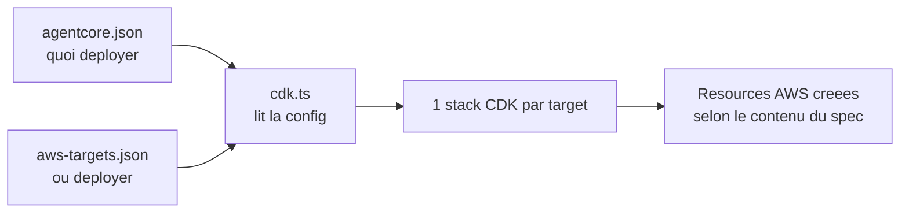

# Lot 2 Infra MVP

## Objectif

Définir une cible infra AWS **minimale, démontrable et réversible** pour sortir du mode purement local sans transformer le projet en plateforme complexe.

Cette note sert à cadrer le Lot 2 avant de modifier `deploy.sh` et `destroy.sh`.

---

## Résumé exécutif

Recommandation pour le MVP infra :

- `API Gateway` comme point d'entrée HTTP
- `AWS_IAM` comme protection minimale de l'endpoint via `SigV4`
- `Bedrock AgentCore` comme runtime d'orchestration cible
- `AgentCore Gateway` comme surface d'exposition des tools
- `Amazon Bedrock` pour les appels LLM optionnels
- `S3` pour les données projet, les sorties de harness et les artefacts simples
- `CloudWatch Logs` pour l'observabilité de base
- `IAM` minimal, centré sur `bedrock:InvokeModel`, `logs:*` sur le groupe dédié, et accès ciblé au bucket S3 du projet
- bucket S3 durci par défaut : chiffrement, blocage public, ownership controls, versioning
- `deploy.sh` produit aussi un `deploy-outputs.json` pour réutiliser les sorties de déploiement côté teardown, smoke et harness

Choix assumé :

- faire d'`AgentCore` et de `Bedrock` le coeur de la cible POC
- conserver la séparation `tools / agents / hooks / deterministic core` pour garder une architecture défendable

Raison principale :

- c'est le chemin le plus cohérent pour raconter une **démo AWS agentique réelle**, multi-agent et multi-LLM, sans laisser le local devenir le message principal du projet

---

## Contexte de charge

### Faits

- projet portfolio, pas produit de production
- délai court
- moteur local fonctionnel déjà implémenté
- scoring principal déterministe
- usage LLM optionnel pour `Events Agent`, `Review Agent`, `Executive Summary`
- scripts infra encore placeholders

### Hypothèses

- un seul compte AWS de démo
- une seule région AWS
- faible trafic, exécution manuelle ou semi-manuelle
- aucune donnée sensible métier réelle
- pas d'exigence multi-AZ métier forte pour le MVP

### Inconnues

- région AWS cible
- modèle Bedrock exact visé en production démo
- besoin réel ou non d'un endpoint public persistant pour la démo

---

## Pondération des piliers

### Poids

- `Operational Excellence`: 5
- `Cost Optimization`: 5
- `Security`: 4
- `Reliability`: 3
- `Performance Efficiency`: 2
- `Sustainability`: 2

### Justification

- `Operational Excellence` est dominant car l'objectif du lot est un déploiement rapide, lisible et réversible
- `Cost Optimization` est dominant car le MVP doit éviter toute infra décorative ou permanente coûteuse
- `Security` reste importante même sur un POC, surtout sur IAM et exposition publique
- `Reliability` doit être correcte mais proportionnée à une démo portfolio
- `Performance Efficiency` n'est pas critique vu le faible trafic attendu
- `Sustainability` est secondaire à ce stade, sans être ignorée

Implication pratique :

- pas de VPC tant qu'il n'y a pas de ressource privée à joindre
- pas d'EKS
- pas de base de données managée
- pas de multi-région
- peu de composants, tous managés

---

## Architecture recommandée

```text
HTTP client or harness
  -> API Gateway HTTP API
  -> AWS_IAM protected invocation
  -> Bedrock AgentCore runtime
      -> AgentCore Gateway tools
      -> deterministic decision core
      -> Bedrock model access
  -> S3 project data and harness outputs
  -> CloudWatch Logs
```

### Composants

#### 1. API Gateway HTTP API

Rôle :

- exposer un endpoint simple pour lancer un scénario
- éviter une dépendance à un poste local pour la démo

Pourquoi ce choix :

- plus léger et moins cher qu'un front plus complexe
- suffisant pour un payload JSON simple

#### 2. Bedrock AgentCore

Rôle :

- orchestrer les hooks, agents spécialisés, accès tools, revue et synthèse
- fournir la couche agentique explicite du POC AWS
- rendre visible la séparation entre orchestration, tools et décision métier

Pourquoi ce choix :

- c'est la capacité AWS que le projet doit démontrer
- cela aligne la cible avec le message portfolio multi-agent
- cela évite de raconter une cible AWS alors que le runtime réel reste trop proche d'un simple wrapper local

#### 3. AgentCore Gateway

Rôle :

- exposer les tools de contexte et de données à l'orchestrateur agentique
- préserver des contrats stables entre collecte brute et interprétation métier

Pourquoi ce choix :

- c'est une pièce importante de la démonstration agentique AWS
- cela évite de fusionner collecte, tool calling et raisonnement métier
#### 4. S3

Rôle :

- stocker les données MVP versionnées si on veut les externaliser du package
- stocker éventuellement les outputs de démo
- garder un point simple pour les artefacts

Pourquoi ce choix :

- simple, durable, natif AWS
- utile sans imposer une base de données

#### 5. Amazon Bedrock

Rôle :

- fournir les appels LLM quand `EVENTS_AGENT_MODE`, `REVIEW_AGENT_MODE` ou `EXECUTIVE_SUMMARY_MODE` sont activés

Pourquoi ce choix :

- aligne la démo avec la cible AWS
- remplace avantageusement OpenRouter dans la version AWS

#### 6. CloudWatch Logs

Rôle :

- centraliser les logs d'exécution
- tracer les décisions critiques, le scénario, les providers utilisés et les warnings

Pourquoi ce choix :

- indispensable pour une démo défendable
- coût faible si la rétention est bornée

---

## Ce qu'on ne met pas dans le MVP infra

- `EKS`
- `ECS`
- `RDS`
- `VPC` dédiée sans besoin privé avéré
- `Terraform/OpenTofu` avant stabilisation
- `Step Functions`
- `EventBridge` pour l'orchestration principale
- `AWS Lambda` comme architecture canonique du POC

Raison :

- ces briques augmentent la complexité, le temps de setup, et le coût cognitif sans améliorer clairement la démonstration MVP à ce stade

---

## Position sur AgentCore

### Recommandation

Traiter `AgentCore` comme le **runtime cible du POC**, pas comme une évolution cosmétique.

### Pourquoi

- le but du projet est de montrer une solution agentique AWS crédible
- `AgentCore Gateway` et la structuration multi-agent font partie de la valeur démontrée
- l'architecture doit raconter autre chose qu'un moteur local simplement hébergé sur AWS

### Ce qu'il faut préparer dès maintenant

- garder les interfaces tools stables
- expliciter la frontière entre raisonnement déterministe et usage LLM
- sécuriser l'endpoint avec `AWS_IAM`
- prévoir le harness sur le même endpoint déployé

---

## Découpage recommandé du Lot 2

### 2A. AWS deployable target

Livrer :

- un endpoint API Gateway
- une auth `AWS_IAM` opérationnelle
- un runtime `Bedrock AgentCore`
- un `AgentCore Gateway`
- un bucket S3 projet
- un rôle IAM minimal
- des variables d'environnement centralisées
- des logs CloudWatch propres
- un harness de scénarios branché sur le même endpoint
- `deploy.sh` et `destroy.sh` réellement utiles

Critère de sortie :

- un scénario et un run de harness peuvent être lancés sur AWS via le même endpoint sécurisé

---

## Scripts attendus

### `bootstrap.sh`

Doit vérifier :

- `python`
- `aws`
- identifiants AWS valides
- région configurée
- accès Bedrock si mode LLM AWS activé

### `deploy.sh`

Doit faire au minimum :

---

## Comprendre le déploiement AgentCore

Cette section remplace l'ancien document `AGENTCORE_DEPLOY_FLOW.md`.

### Objectif

Expliquer simplement :

- ce que contient `agentcore/`
- comment `cdk.ts` s'en sert
- comment `agentcore deploy` sait quoi déployer

### Schéma simple



### Lecture rapide

- `agentcore.json` décrit les ressources du projet
  Exemple : `runtimes`, `agentCoreGateways`, `memories`, `credentials`
- `aws-targets.json` décrit les cibles de déploiement
  Exemple : `account`, `region`, `name`
- `cdk.ts` lit les deux fichiers, puis instancie une stack par target
- `agentcore deploy` n'a pas besoin d'autres paramètres car il trouve déjà la config dans le projet courant

### Ce qu'il y a dans `agentcore/`

Le dossier `agentcore/` contient la partie **déclarative** du projet AgentCore.

Les fichiers importants sont :

- `agentcore.json`
  C'est le spec principal du projet.
  Il décrit les ressources agentiques à créer.
- `aws-targets.json`
  C'est la liste des cibles de déploiement.
  Sans ce fichier renseigné, le CLI ne sait pas dans quel compte/région déployer.
- `cdk/`
  C'est le projet CDK généré/vendu avec AgentCore.
  Il sert de traduction entre le spec JSON et les stacks AWS.
- `.cli/deployed-state.json`
  Fichier optionnel généré après déploiement.
  Il sert surtout à relire des identifiants déjà créés, par exemple certains ARNs de credentials.

En pratique, il faut penser `agentcore/` comme :

- une **source de vérité déclarative**
- plus une **couche de traduction CDK**

### En une phrase

- `agentcore.json` = **quoi**
- `aws-targets.json` = **où**
- `cdk.ts` = **traduction en CDK**
- `agentcore deploy` = **déploiement**

### Séquence réelle de `agentcore deploy`

Quand tu lances :

```bash
cd agentcore-project/UrbanCampaignIntelligencePoc
agentcore deploy
```

la logique conceptuelle est la suivante :

1. le CLI se place sur le projet courant
2. il lit `agentcore/agentcore.json`
3. il lit `agentcore/aws-targets.json`
4. il lance la partie CDK du projet
5. `cdk.ts` transforme le spec en une ou plusieurs stacks
6. CDK synthétise puis déploie sur chaque target déclarée

Autrement dit :

- le CLI ne te demande pas "quoi déployer"
- il le sait déjà parce que le projet courant contient la configuration

### Ce que fait `cdk.ts`

`cdk.ts` joue le rôle de **pont** entre le JSON AgentCore et AWS CDK.

Concrètement, il fait ces choses :

1. il calcule la racine de config
2. il lit le `project spec`
3. il lit les `deployment targets`
4. il enrichit la config si certains blocs existent
5. il crée une stack par target
6. il appelle `app.synth()`

Les points importants dans ton fichier actuel :

- `readProjectSpec()`
  lit `agentcore.json`
- `readAWSDeploymentTargets()`
  lit `aws-targets.json`
- si `targets.length === 0`
  le process échoue
- pour chaque target
  `new AgentCoreStack(...)` est instancié

Donc `cdk.ts` ne porte pas la logique métier du projet.
Il porte la logique de **construction de stack**.

### Ce que `cdk.ts` peut enrichir avant de créer la stack

Le spec lu depuis `agentcore.json` peut être enrichi par d'autres sources locales :

- `agentCoreGateways`
  pour la configuration MCP / gateway
- `.cli/deployed-state.json`
  pour retrouver certains ARNs déjà créés
- `harness.json`
  si le projet déclare des `harnesses`
- certains fichiers JSON de connecteurs
  pour les knowledge bases

Donc la stack finale peut dépendre :

- du spec principal
- des targets
- et d'un petit nombre de fichiers auxiliaires

### Cas concret dans ce repo

Aujourd'hui, ton `agentcore.json` déclare surtout :

- un `runtime`
  - `build = CodeZip`
  - `entrypoint = main.py`
  - `codeLocation = app/UrbanCampaignIntelligencePoc/`
  - `runtimeVersion = PYTHON_3_14`
  - `networkMode = PUBLIC`
  - `protocol = HTTP`

Et le reste est vide :

- `agentCoreGateways = []`
- `memories = []`
- `credentials = []`
- `knowledgeBases = []`
- `harnesses = []`
- `payments = []`

Donc si `aws-targets.json` était rempli, le déploiement tenterait surtout de créer :

- le runtime AgentCore correspondant à ce code Python
- la stack CDK associée à cette cible

Mais pas encore :

- de gateway
- de memory
- de credential provider spécifique
- de knowledge base
- de harness

### Pourquoi `deploy.sh` skip aujourd'hui

Dans ton repo, `deploy.sh` ne laisse pas partir le `agentcore deploy` si `aws-targets.json` est vide.

Donc aujourd'hui :

- `agentcore.json` dit bien **quoi**
- mais `aws-targets.json` ne dit pas encore **où**

Résultat :

- le projet AgentCore est valide
- mais le déploiement live est volontairement bloqué

### État actuel du repo

- `agentcore.json` contient surtout un runtime
- `agentCoreGateways` est vide
- `aws-targets.json` vaut `[]`

Conséquence :

- `deploy.sh` peut préparer S3 et les artefacts
- mais il ne lance pas de vrai `agentcore deploy` live, car aucune target AWS n'est encore configurée

### Fichiers clés

- [agentcore.json](/home/xclem/projetsperso/agentic-campaign/agentcore-project/UrbanCampaignIntelligencePoc/agentcore/agentcore.json)
- [aws-targets.json](/home/xclem/projetsperso/agentic-campaign/agentcore-project/UrbanCampaignIntelligencePoc/agentcore/aws-targets.json)
- [cdk.ts](/home/xclem/projetsperso/agentic-campaign/agentcore-project/UrbanCampaignIntelligencePoc/agentcore/cdk/bin/cdk.ts)

### Annexe

Si tu veux le schéma détaillé éditable, il reste disponible ici :

- [agentcore-deploy-flow.drawio](/home/xclem/projetsperso/agentic-campaign/docs/diagrams/agentcore-deploy-flow.drawio)
- [agentcore-deploy-flow.preview.png](/home/xclem/projetsperso/agentic-campaign/docs/diagrams/agentcore-deploy-flow.preview.png)
- [agentcore-deploy-flow.svg](/home/xclem/projetsperso/agentic-campaign/docs/diagrams/agentcore-deploy-flow.svg)

- valider les variables d'environnement
- valider le projet AgentCore avant toute création AWS évitable
- créer ou réutiliser un bucket S3 dédié
- durcir le bucket immédiatement après création ou réutilisation
- préparer les artefacts ou configurations nécessaires au runtime agentique
- produire un manifest et un `deploy-outputs.json` réutilisables
- préparer le rôle IAM minimal
- préparer l'HTTP API et sa protection `AWS_IAM`
- créer les composants AgentCore / Gateway nécessaires
- capturer le statut AgentCore déployé
- afficher l'URL finale, les ressources créées et les instructions de smoke test si l'invocation finale reste manuelle

### `demo.sh`

Doit pouvoir :

- appeler l'endpoint AWS avec un scénario connu
- écrire la réponse dans `outputs/`

### `destroy.sh`

Doit supprimer :

- runtime AgentCore / stack CDK associée
- objets et bucket S3 du projet si explicitement demandé
- outputs locaux si explicitement demandé

---

## IAM minimal visé

### AgentCore runtime role

Permissions minimales attendues :

- écriture logs CloudWatch
- lecture S3 ciblée sur le bucket projet
- écriture S3 ciblée si outputs persistés
- `bedrock:InvokeModel` limité aux modèles réellement utilisés

### Ce qu'il faut éviter

- politiques `*` sur toutes les actions
- bucket public
- droits IAM de création trop larges laissés au runtime

---

## Observabilité minimale

Chaque exécution AWS doit loguer au moins :

- `scenario_id`
- `request_id`
- providers activés
- modes LLM activés ou non
- warnings
- top recommendation
- durée d'exécution

Le script de déploiement doit aussi conserver :

- un manifest de déploiement
- la sortie `agentcore status`
- les références du bucket, des artefacts et du endpoint

La rétention CloudWatch doit être bornée explicitement.

---

## Principaux risques

### [Medium] Smoke test signé encore manuel
Piliers: Operational Excellence, Security
Evidence: `deploy.sh` sait préparer le contexte mais n'invoque pas encore automatiquement l'endpoint `AWS_IAM` avec une requête `SigV4`.
Impact: une partie de la validation reste manuelle après déploiement.
Recommendation: brancher un harness ou une commande signée stable sur le endpoint final.
Trade-off: un peu plus d'effort de scripting, mais une démo plus propre.
Confidence: High

### [Medium] Surconstruire l'infra pour un workload de démo
Piliers: Cost Optimization, Operational Excellence
Evidence: le trafic prévu est faible et le système est essentiellement déclenché à la demande.
Impact: temps perdu, maintenance inutile, coût plus élevé.
Recommendation: rester sur du serverless managé et peu de composants.
Trade-off: moins de sophistication, mais meilleure vitesse d'exécution.
Confidence: High

### [Medium] IAM trop permissif pour gagner du temps
Piliers: Security
Evidence: les scripts de déploiement n'existent pas encore et la tentation du `*` est forte en MVP.
Impact: posture sécurité faible et architecture moins défendable en entretien.
Recommendation: cadrer tout de suite les permissions minimales par rôle.
Trade-off: un peu plus de travail initial sur les scripts.
Confidence: High

---

## Décisions recommandées maintenant

1. Garder `API Gateway + AWS_IAM + AgentCore + AgentCore Gateway + Bedrock + S3 + CloudWatch` comme cible POC.
2. Finaliser le parcours de smoke test signé sur le même endpoint que le harness.
3. Continuer à restreindre l'IAM autour des seuls besoins runtime et déploiement.

---

## Ce qui ferait changer cette recommandation

- besoin d'orchestration longue, asynchrone ou multi-étapes avec état
- besoin de ressources privées nécessitant VPC et connectivité dédiée
- forte exigence de reproductibilité infra par IaC dès maintenant
