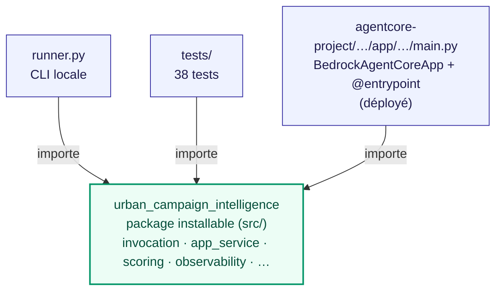
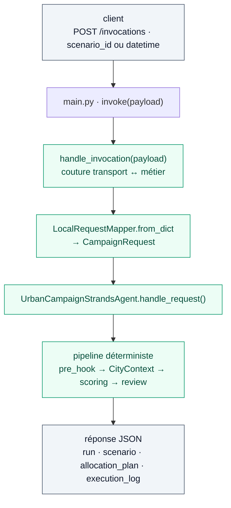
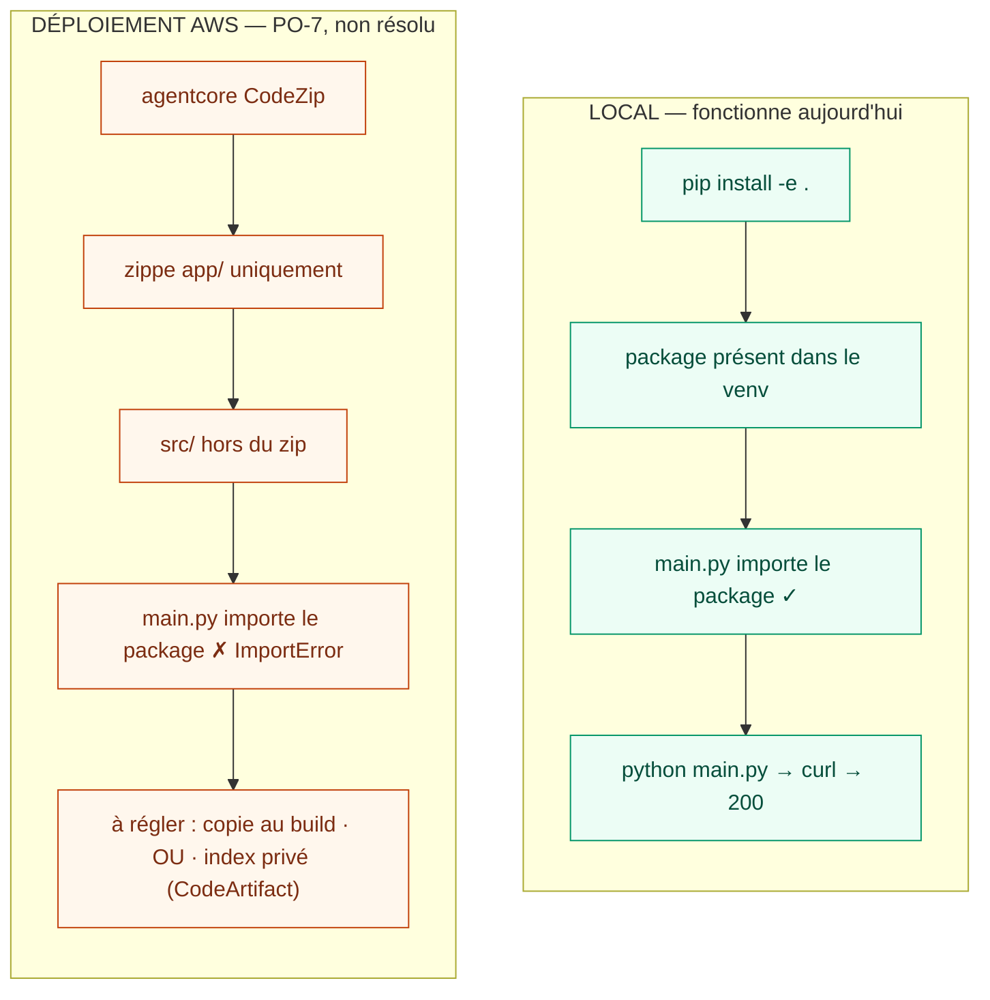

# Packaging — un métier partagé, trois façades

Ce document explique comment le code est structuré depuis le câblage de l'entrypoint canonique
(option A) : un **package métier unique**, importé par la CLI, les tests et le runtime AgentCore.

Voir aussi [ARCHITECTURE.md](../ARCHITECTURE.md) §12.2 (trajectoire) et le point ouvert **PO-7**
(packaging de déploiement).

## 1. Qui contient quoi, qui importe quoi

Le métier vit dans un seul package installable. Les trois façades l'importent — aucune ne le
duplique. `handle_invocation` est la couture entre un transport et le pipeline.

Un seul métier, trois façades. Le doublon local (`runtime_app.py`) a été supprimé : il ne reste
qu'un entrypoint canonique, `main.py`.

## 2. Le flux d'une requête

Identique en local et déployé — c'est le même code.

Sans Bedrock configuré, chaque étage LLM dégrade vers son heuristique : la verticale tourne hors
ligne. La réponse porte son identifiant de corrélation sous `run.run_id`.

## 3. Local vs déploiement — la seule différence

En local, le package est installé dans le venv, donc `main.py` le trouve. Au déploiement, `CodeZip`
ne prend que `codeLocation` (`app/`) : le package doit y entrer autrement. C'est **PO-7**.

La path-dependency ne résout pas le déploiement : elle pointe hors de `codeLocation`, que le zip
ignore. La décision (copie au build vs index privé) est reportée au premier déploiement réel, lui-même
bloqué par l'accès Bedrock et le quota `AWS::BedrockAgentCore::Runtime`.
