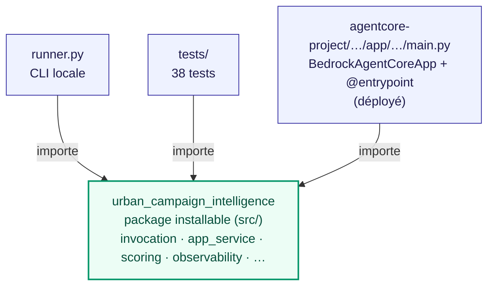
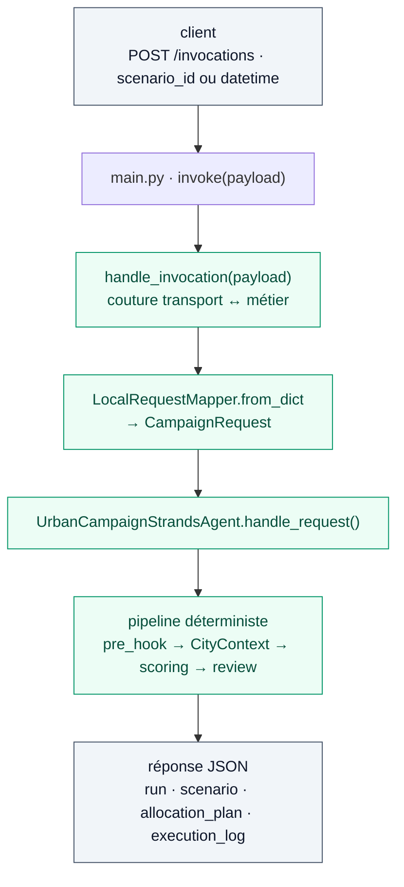
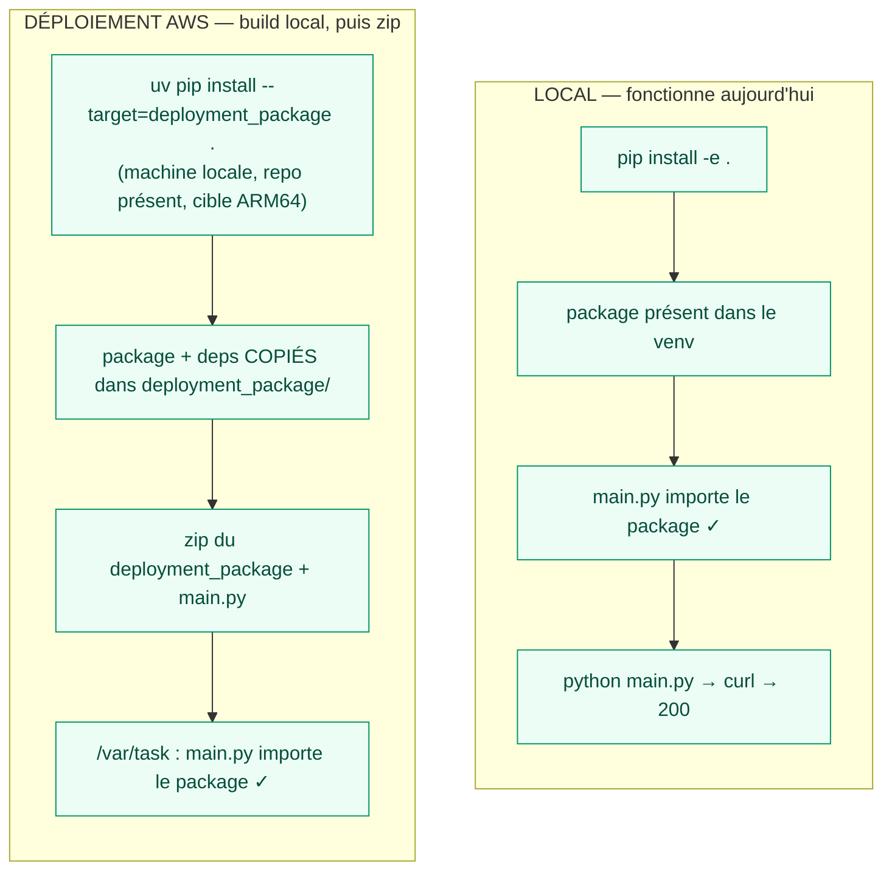

# Packaging — un métier partagé, trois façades

Ce document explique comment le code est structuré depuis le câblage de l'entrypoint canonique
(option A) : un **package métier unique**, importé par la CLI, les tests et le runtime AgentCore.

Voir aussi [ARCHITECTURE.md](../ARCHITECTURE.md) §12.2 (trajectoire) et le point ouvert **PO-7**
(packaging de déploiement).

## 1. Qui contient quoi, qui importe quoi

Le métier vit dans un seul package installable. Les trois façades l'importent — aucune ne le
duplique. `handle_invocation` est la couture entre un transport et le pipeline.



Un seul métier, trois façades. Le doublon local (`runtime_app.py`) a été supprimé : il ne reste
qu'un entrypoint canonique, `main.py`.

## 2. Le flux d'une requête

Identique en local et déployé — c'est le même code.



Sans Bedrock configuré, chaque étage LLM dégrade vers son heuristique : la verticale tourne hors
ligne. La réponse porte son identifiant de corrélation sous `run.run_id`.

## 3. Local vs déploiement — le même code, deux façons de le placer

La règle AWS est simple : **tout le code déployé finit dans le zip**, décompressé sous `/var/task`,
premier répertoire du `sys.path`
([doc officielle](https://docs.aws.amazon.com/bedrock-agentcore/latest/devguide/runtime-get-started-code-deploy-python.html)).
Il n'existe pas de « path-dependency » vue par le runtime : le conteneur ne voit que le paquet.

En local, `pip install -e .` met le package dans le venv → `main.py` le trouve. Pour le déploiement,
on **copie** le package dans le paquet au moment du build, avec la commande officielle `uv pip
install --target` — mécanisme standard, pas un contournement.



Le point clé : la référence au package est résolue **au build** (localement, où tout le repo est là),
puis **copiée**. Au runtime il ne reste qu'une copie dans le zip — aucune dépendance externe à résoudre.

## 4. Faire entrer le package dans le zip (PO-7)

Procédure de référence, à câbler dans le script de déploiement au déblocage AWS :

```bash
# 1. installer le package + ses deps pour la cible ARM64 du runtime, dans un dossier
uv pip install \
  --python-platform aarch64-manylinux2014 \
  --python-version 3.13 \
  --target=deployment_package \
  --only-binary=:all: \
  .

# 2. ajouter l'entrypoint, puis zipper
cp agentcore-project/.../app/.../main.py deployment_package/
cd deployment_package && zip -r ../deployment_package.zip .
```

Deux points de vigilance :

- **ARM64 obligatoire** : le runtime AgentCore tourne en `aarch64`. Des wheels `x86_64` échouent au
  déploiement. Nos deps (`strands-agents`, `pydantic`, `boto3`) sont pures Python ou ont des wheels
  ARM64, donc OK — mais toute future dépendance native devra être buildée pour ARM64.
- **Pas de `__pycache__`** dans le paquet (bytecode compilé sur une autre archi, incompatible).

Cette étape est **testable seulement au déblocage** (accès Bedrock + quota
`AWS::BedrockAgentCore::Runtime`). Voir ARCHITECTURE.md §15 (PO-7).

> Note d'organisation : ce document pourra à terme être résorbé, la procédure §4 rejoignant
> [RUNBOOK_DEPLOY.md](RUNBOOK_DEPLOY.md) et les schémas §1–2 restant le support d'explication.
