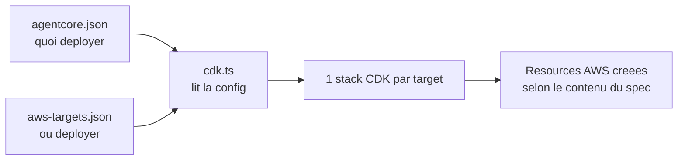

# Runbook — Déploiement AWS / AgentCore

> Procédures opérationnelles du Lot 2 : scripts attendus, mécanique de déploiement AgentCore,
> IAM minimal et observabilité minimale.
>
> Les décisions d'architecture correspondantes sont dans [../ARCHITECTURE.md](../ARCHITECTURE.md).
> L'analyse qui a conduit à ces décisions est archivée dans
> [archive/2026-07-lot2-infra-analyse.md](archive/2026-07-lot2-infra-analyse.md).

---

## Scripts attendus

### `bootstrap.sh`

Doit vérifier :

- `python`
- `aws`
- identifiants AWS valides
- région configurée
- accès Bedrock si mode LLM AWS activé

### `deploy.sh`

Doit faire au minimum :

---

## Comprendre le déploiement AgentCore

Cette section remplace l'ancien document `AGENTCORE_DEPLOY_FLOW.md`.

### Objectif

Expliquer simplement :

- ce que contient `agentcore/`
- comment `cdk.ts` s'en sert
- comment `agentcore deploy` sait quoi déployer

### Schéma simple



### Vue concrète : la stack réellement déployée

Vue détaillée de la même chaîne, avec les ressources réelles d'un déploiement de ce repo :



La stack `AgentCore-UrbanCampaignIntelPoc-default` (compte `194031983377`, `us-east-1`, profil
`aws100demo1`) possède **11 ressources** (hors `AWS::CDK::Metadata`) :

**Côté Runtime**

| Ressource | Type | Note |
|---|---|---|
| **AgentCore Runtime** | `AWS::BedrockAgentCore::Runtime` | héberge `main.py` ; compté par le quota `maxAgents` |
| Rôle d'exécution | `AWS::IAM::Role` | rôle du runtime |
| Policy du rôle | `AWS::IAM::Policy` | `bedrock:InvokeModel` · CloudWatch · accès gateway |

**Côté Gateway / tools**

| Ressource | Type | Note |
|---|---|---|
| **Gateway** (MCP) | `AWS::BedrockAgentCore::Gateway` | `authorizerType: AWS_IAM` |
| Gateway Target | `AWS::BedrockAgentCore::GatewayTarget` | lie les 3 tools → Lambda |
| **Lambda** | `AWS::Lambda::Function` | `UrbanCampaignIntelPoc-contextTools` (python3.13) |
| Log Group Lambda | `AWS::Logs::LogGroup` | `/aws/lambda/UrbanCampaignIntelPoc-contextTools` |
| Rôle Lambda | `AWS::IAM::Role` | exécution de la Lambda |
| Rôle Gateway + Policy | `AWS::IAM::Role` + `Policy` | permet au Gateway d'invoquer la Lambda |

- **Runtime ARN** : `arn:aws:bedrock-agentcore:us-east-1:194031983377:runtime/UrbanCampaignIntelPoc_UrbanCampaignIntelPoc-9WdEB7BnPP`
- **Gateway URL (MCP)** : `https://urbancampaignintelpoc-urbancampaigntools-4nhesyuq9h.gateway.bedrock-agentcore.us-east-1.amazonaws.com/mcp`
- **Hors stack** : bucket S3 d'artefacts `urban-campaign-intelligence-poc-194031983377-us-east-1`, log group runtime `/aws/bedrock-agentcore/runtimes/…-DEFAULT`.
- **Préexistant, réutilisé** : bootstrap CDK (`CDKToolkit` v32) — son **bucket d'assets** `cdk-hnb659fds-assets-…` reçoit le template + le `.zip` Lambda à chaque `cdk deploy` ; **ne pas le supprimer** (sinon `Failed to publish asset`, re-bootstrap requis).

> ⚠️ État : le Gateway est **déployé et sert du réel** (Lambda testée : `open_meteo`, `paris_open_data`,
> `forecast`), mais l'agent du runtime ne le consomme **pas encore** (il utilise ses `@tool` locaux). Le
> rewire de l'orchestrateur (MCP + SigV4) est la marche suivante.

Régénérer l'inventaire :
`aws cloudformation describe-stack-resources --stack-name AgentCore-UrbanCampaignIntelPoc-default` (profil `aws100demo1`).

Utiliser / tester le runtime : voir [../agentcore-project/…/main.py](../agentcore-project/UrbanCampaignIntelligencePoc/app/UrbanCampaignIntelligencePoc/main.py) ;
invoquer via `agentcore invoke "…" --target default` ; teardown via `destroy.sh` (= `cdk destroy`, supprime toute la stack).

### Lecture rapide

- `agentcore.json` décrit les ressources du projet
  Exemple : `runtimes`, `agentCoreGateways`, `memories`, `credentials`
- `aws-targets.json` décrit les cibles de déploiement
  Exemple : `account`, `region`, `name`
- `cdk.ts` lit les deux fichiers, puis instancie une stack par target
- `agentcore deploy` n'a pas besoin d'autres paramètres car il trouve déjà la config dans le projet courant

### Ce qu'il y a dans `agentcore/`

Le dossier `agentcore/` contient la partie **déclarative** du projet AgentCore.

Les fichiers importants sont :

- `agentcore.json`
  C'est le spec principal du projet.
  Il décrit les ressources agentiques à créer.
- `aws-targets.json`
  C'est la liste des cibles de déploiement.
  Sans ce fichier renseigné, le CLI ne sait pas dans quel compte/région déployer.
- `cdk/`
  C'est le projet CDK généré/vendu avec AgentCore.
  Il sert de traduction entre le spec JSON et les stacks AWS.
- `.cli/deployed-state.json`
  Fichier optionnel généré après déploiement.
  Il sert surtout à relire des identifiants déjà créés, par exemple certains ARNs de credentials.

En pratique, il faut penser `agentcore/` comme :

- une **source de vérité déclarative**
- plus une **couche de traduction CDK**

### En une phrase

- `agentcore.json` = **quoi**
- `aws-targets.json` = **où**
- `cdk.ts` = **traduction en CDK**
- `agentcore deploy` = **déploiement**

### Séquence réelle de `agentcore deploy`

Quand tu lances :

```bash
cd agentcore-project/UrbanCampaignIntelligencePoc
agentcore deploy
```

la logique conceptuelle est la suivante :

1. le CLI se place sur le projet courant
2. il lit `agentcore/agentcore.json`
3. il lit `agentcore/aws-targets.json`
4. il lance la partie CDK du projet
5. `cdk.ts` transforme le spec en une ou plusieurs stacks
6. CDK synthétise puis déploie sur chaque target déclarée

Autrement dit :

- le CLI ne te demande pas "quoi déployer"
- il le sait déjà parce que le projet courant contient la configuration

### Ce que fait `cdk.ts`

`cdk.ts` joue le rôle de **pont** entre le JSON AgentCore et AWS CDK.

Concrètement, il fait ces choses :

1. il calcule la racine de config
2. il lit le `project spec`
3. il lit les `deployment targets`
4. il enrichit la config si certains blocs existent
5. il crée une stack par target
6. il appelle `app.synth()`

Les points importants dans ton fichier actuel :

- `readProjectSpec()`
  lit `agentcore.json`
- `readAWSDeploymentTargets()`
  lit `aws-targets.json`
- si `targets.length === 0`
  le process échoue
- pour chaque target
  `new AgentCoreStack(...)` est instancié

Donc `cdk.ts` ne porte pas la logique métier du projet.
Il porte la logique de **construction de stack**.

### Ce que `cdk.ts` peut enrichir avant de créer la stack

Le spec lu depuis `agentcore.json` peut être enrichi par d'autres sources locales :

- `agentCoreGateways`
  pour la configuration MCP / gateway
- `.cli/deployed-state.json`
  pour retrouver certains ARNs déjà créés
- `harness.json`
  si le projet déclare des `harnesses`
- certains fichiers JSON de connecteurs
  pour les knowledge bases

Donc la stack finale peut dépendre :

- du spec principal
- des targets
- et d'un petit nombre de fichiers auxiliaires

### Cas concret dans ce repo

Aujourd'hui, ton `agentcore.json` déclare surtout :

- un `runtime`
  - `build = CodeZip`
  - `entrypoint = main.py`
  - `codeLocation = app/UrbanCampaignIntelligencePoc/`
  - `runtimeVersion = PYTHON_3_14`
  - `networkMode = PUBLIC`
  - `protocol = HTTP`

Et le reste est vide :

- `agentCoreGateways = []`
- `memories = []`
- `credentials = []`
- `knowledgeBases = []`
- `harnesses = []`
- `payments = []`

Donc si `aws-targets.json` était rempli, le déploiement tenterait surtout de créer :

- le runtime AgentCore correspondant à ce code Python
- la stack CDK associée à cette cible

Mais pas encore :

- de gateway
- de memory
- de credential provider spécifique
- de knowledge base
- de harness

### Pourquoi `deploy.sh` skip aujourd'hui

Dans ton repo, `deploy.sh` ne laisse pas partir le `agentcore deploy` si `aws-targets.json` est vide.

Donc aujourd'hui :

- `agentcore.json` dit bien **quoi**
- mais `aws-targets.json` ne dit pas encore **où**

Résultat :

- le projet AgentCore est valide
- mais le déploiement live est volontairement bloqué

### État actuel du repo

- `agentcore.json` contient surtout un runtime
- `agentCoreGateways` est vide
- `aws-targets.json` vaut `[]`

Conséquence :

- `deploy.sh` peut préparer S3 et les artefacts
- mais il ne lance pas de vrai `agentcore deploy` live, car aucune target AWS n'est encore configurée

### Fichiers clés

- [agentcore.json](/home/xclem/projetsperso/agentic-campaign/agentcore-project/UrbanCampaignIntelligencePoc/agentcore/agentcore.json)
- [aws-targets.json](/home/xclem/projetsperso/agentic-campaign/agentcore-project/UrbanCampaignIntelligencePoc/agentcore/aws-targets.json)
- [cdk.ts](/home/xclem/projetsperso/agentic-campaign/agentcore-project/UrbanCampaignIntelligencePoc/agentcore/cdk/bin/cdk.ts)

### Annexe

Si tu veux le schéma détaillé éditable, il reste disponible ici :

- [agentcore-deploy-flow.drawio](diagrams/legacy/agentcore-deploy-flow.drawio)
- [agentcore-deploy-flow.preview.png](diagrams/legacy/agentcore-deploy-flow.preview.png)
- [agentcore-deploy-flow.svg](diagrams/legacy/agentcore-deploy-flow.svg)

- valider les variables d'environnement
- valider le projet AgentCore avant toute création AWS évitable
- créer ou réutiliser un bucket S3 dédié
- durcir le bucket immédiatement après création ou réutilisation
- préparer les artefacts ou configurations nécessaires au runtime agentique
- produire un manifest et un `deploy-outputs.json` réutilisables
- préparer le rôle IAM minimal
- fermer une première invocation directe `InvokeAgentRuntime`
- créer les composants AgentCore nécessaires
- n'ajouter `Gateway` et `API Gateway + AWS_IAM` que si la cible finale le justifie
- capturer le statut AgentCore déployé
- afficher la cible finale, les ressources créées et les instructions de smoke test si l'invocation finale reste manuelle

### `demo.sh`

Doit pouvoir :

- appeler l'endpoint AWS avec un scénario connu
- écrire la réponse dans `outputs/`

### `destroy.sh`

Doit supprimer :

- runtime AgentCore / stack CDK associée
- objets et bucket S3 du projet si explicitement demandé
- outputs locaux si explicitement demandé

---

## IAM minimal visé

### AgentCore runtime role

Permissions minimales attendues :

- écriture logs CloudWatch
- lecture S3 ciblée sur le bucket projet
- écriture S3 ciblée si outputs persistés
- `bedrock:InvokeModel` limité aux modèles réellement utilisés

### Ce qu'il faut éviter

- politiques `*` sur toutes les actions
- bucket public
- droits IAM de création trop larges laissés au runtime

---

## Observabilité minimale

Chaque exécution AWS doit loguer au moins :

- `scenario_id`
- `request_id`
- providers activés
- modes LLM activés ou non
- warnings
- top recommendation
- durée d'exécution

Le script de déploiement doit aussi conserver :

- un manifest de déploiement
- la sortie `agentcore status`
- les références du bucket, des artefacts et du endpoint

La rétention CloudWatch doit être bornée explicitement.

---

