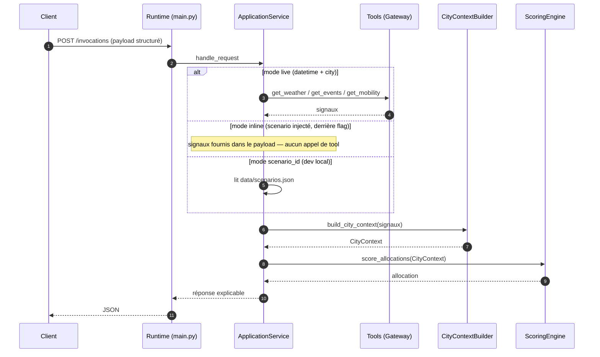
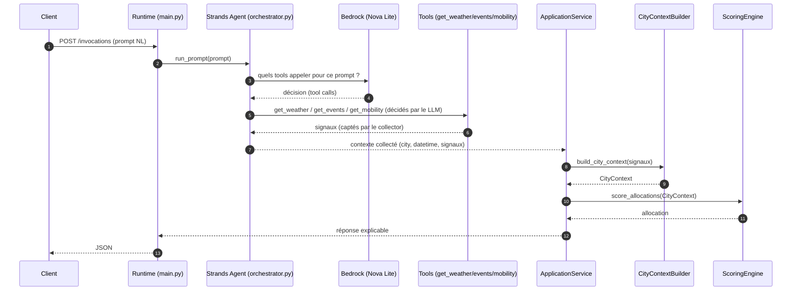
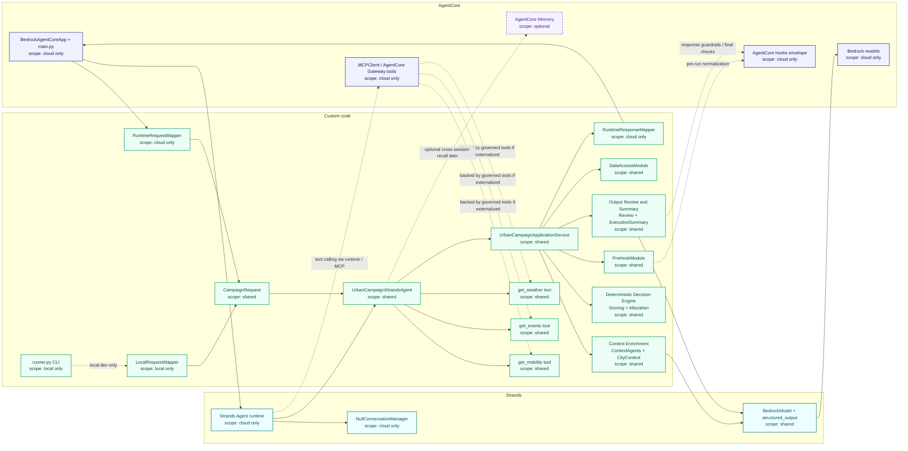

# Mapping runtime — composants et frontières

Ce document descend d'un cran sous [../ARCHITECTURE.md](../ARCHITECTURE.md) §5.2 : là où le DAT
décrit des **rôles**, celui-ci mappe les **fichiers et classes réels** du projet sur la frontière
AgentCore / Strands / code métier.

Il répond à une seule question : *pour chaque brique du code, qui la gouverne et où s'exécute-t-elle ?*

| Pour… | Voir |
| --- | --- |
| l'architecture cible et les décisions | [../ARCHITECTURE.md](../ARCHITECTURE.md) |
| l'état d'avancement réel | [STATUS.md](STATUS.md) |
| le choix « option 2 » | [DECISIONS.md](DECISIONS.md) ADR-006 |
| le choix du fournisseur de modèles | [DECISIONS.md](DECISIONS.md) ADR-007 |

## Modes d'entrée — payload structuré vs prompt

Le runtime a **une seule sortie** (une recommandation explicable via un scoring déterministe) mais
**plusieurs façons d'y entrer**. Ce qui distingue les modes, c'est **qui appelle les tools** — ou si
personne ne les appelle. Les diagrammes ci-dessous montrent la séquence d'appels, mode par mode.

Vue d'ensemble d'un run réel sur le **runtime déployé** (mode prompt), de `InvokeAgentRuntime` à la
réponse :

### Modes structurés (socle déterministe) : c'est le **code** qui orchestre

En live/inline/scenario_id, `UrbanCampaignApplicationService` pilote une séquence **fixe**. Seul le
mode **live** appelle réellement les tools ; l'inline reçoit les signaux dans le payload, le
scenario_id les lit d'un fichier.

**Qui appelle quoi** : c'est `ApplicationService` (du code) qui appelle les tools, dans un ordre figé.
Le LLM ne décide de rien ici — c'est la voie déterministe, conservée pour les tests et la CLI. Le
mode agentique (l'agent décide) est décrit juste après.

### Mode prompt : c'est l'**agent** qui décide et appelle

Avec un prompt en langage naturel, l'agent Strands interroge le modèle pour savoir **quels** tools
appeler, puis les appelle. C'est le « le LLM décide des tool calls » du DAT (§5.1.2). **Implémenté**
dans [`orchestrator.py`](../src/urban_campaign_intelligence/orchestrator.py) : un `strands.Agent` sur
Nova Lite (Bedrock) expose `get_weather`/`get_events`/`get_mobility` en `@tool`, extrait ville et
datetime du prompt, décide des appels et un collecteur capte les signaux. Testé réellement.

L'agent orchestre **l'entrée seulement**. Une fois les signaux collectés, il rend la main : c'est
`UrbanCampaignApplicationService._run_pipeline` (du code déterministe) qui construit le `CityContext`
et score — **hors de l'agent**, comme dans les modes structurés (ADR-002). La frontière est donc la
même partout ; seule change la façon de **récupérer les signaux**.

**La seule vraie différence** entre les deux : *qui* récupère les signaux. En structuré, le **code**,
dans un ordre fixe. En prompt, l'**agent**, sur décision du **LLM**. À partir des signaux, tout est
identique et déterministe : `CityContextBuilder` normalise, `ScoringEngine` score — jamais dans un
prompt, et jamais dans l'agent. (Les context agents qui interprètent les signaux, `events_agent`
pouvant être LLM, sont élidés ici — voir la vue intégrée plus bas.)

| Mode | Payload | Contexte fourni par | Déterministe ? | Statut | Contrôle d'entrée |
| --- | --- | --- | --- | --- | --- |
| **prompt** *(mode produit)* | langage naturel | agent Strands (décide) | non (interprétation) | ✅ implémenté (Nova Lite), routage runtime déployé à valider | **Guardrail *input*** sur le prompt, à la surface plateforme (§8.3.1) |
| **live** *(déprécié produit)* | structuré | tools appelés par le code | oui | ✅ voie déterministe (tests / CLI) | validation de structure (`pre_hook`) + guardrails de tool |
| **inline** | structuré | l'appelant | oui | ✅ derrière flag (smoke-test runtime) | validation de structure + flag (§8.2.3) |
| **scenario_id** *(déprécié produit)* | structuré | fichier local | oui | ❌ dev only | validation de structure |

Le point qui relie tout : un **prompt** n'est reproductible que si le modèle l'est ; les modes
**structurés** restent la voie de test déterministe, même une fois le prompt disponible. Ce n'est pas
l'un ou l'autre — c'est une **API structurée avec une surcouche NL**.

## Règle de lecture

Le schéma ci-dessous décrit la **cible**. L'agent appelle **déjà réellement** les tools (mode
`prompt`, [`orchestrator.py`](../src/urban_campaign_intelligence/orchestrator.py)) ; ce qui reste
cible, c'est leur **externalisation en surfaces gouvernées** (Gateway / MCP) et `Memory` — voir
[STATUS.md](STATUS.md).

L'accès modèle passe par le **SDK Strands** : `llm_client.StrandsBedrockClient` enveloppe
`BedrockModel` (transport Converse) et `Agent.structured_output` (extraction contrainte par les
schémas Pydantic de `llm_schemas.py`). `OpenRouterClient` reste un repli local transitoire, hors
cible (ADR-007).

## Légende

Blocs :

- **`AgentCore`** : enveloppe runtime et surfaces cloud gouvernées par la plateforme
- **`Strands`** : boucle agentique et orchestration
- **`Custom code`** : logique portée par le code du projet

Couleurs : bleu = `AgentCore`, cyan = `Strands`, vert = code projet, violet pointillé = optionnel.

Scope porté par les labels : `local only`, `shared`, `cloud only`, `optional`.

## Vue intégrée

### Lecture rapide

| Question | Réponse |
| --- | --- |
| Qu'est-ce qui est **local seulement** ? | [runner.py](../src/urban_campaign_intelligence/runner.py), `LocalRequestMapper` |
| Qu'est-ce qui est **partagé** local / cloud ? | `CampaignRequest`, `UrbanCampaignStrandsAgent`, `UrbanCampaignApplicationService`, les 4 blocs métier, la couche providers |
| Qu'apportent **AgentCore et Strands** ? | `BedrockAgentCoreApp + main.py`, `Strands Agent runtime`, **`BedrockModel` + `structured_output`**, les mappers runtime, `MCPClient / Gateway`, `Memory` plus tard |

Le métier reste dans le code du projet. AgentCore apporte l'enveloppe runtime, le tool calling et
les points d'extension cloud. **Strands porte la boucle agentique et l'accès modèle** — depuis la
migration, aucun appel LLM ne part du code projet sans passer par `BedrockModel`. Ce que Strands ne
porte pas : la logique métier critique, et la cascade de repli vers l'heuristique déterministe.

### Détail regroupé dans le schéma

| Bloc du schéma | Composants réels |
| --- | --- |
| `Context Enrichment` | `ContextAgentsModule`, `CityContextModule` |
| accès modèle | `StrandsBedrockClient` → `strands.models.BedrockModel` + `Agent.structured_output` |
| contrats de sortie LLM | `llm_schemas.py` : `EventClassification`, `AllocationReview`, `ExecutiveSummary` |
| `Deterministic Decision Engine` | `ScoringModule`, allocation métier |
| `Output Review and Summary` | `ReviewModule`, `ExecutiveSummaryModule` |
| `get_weather tool` | `MockGatewayProvider`, `OpenMeteoWeatherProvider` |
| `get_events tool` | `GatewayProvider`, `ParisOpenDataEventsProvider` |
| `get_mobility tool` | `GatewayProvider`, `MobilityForecastProvider` |

## Qui contrôle quoi

| Zone | Contrôlé par | Rôle | Observable par défaut | Permissions |
|---|---|---|---|---|
| Runtime entrypoint | AgentCore | recevoir la requête, exécuter le runtime, propager l'identité | oui | IAM du runtime |
| Strands agent loop | Strands | orchestration, choix d'appels, tool calling, prompt | partiellement | héritées du runtime + accès tools |
| Tools externalisés | AgentCore Gateway / MCP | accès gouverné aux sources externes | oui | auth tool par tool |
| Providers inline | code projet | accès direct aux providers Python | seulement si loggué explicitement | permissions du runtime |
| PreHookModule | code projet | validation, normalisation, `time_context` | seulement si loggué explicitement | aucune |
| CityContext / scoring / allocation | code projet | logique métier déterministe | seulement si loggué explicitement | aucune |
| Appels LLM | **Strands `BedrockModel`** sur Bedrock | classification, review, executive summary | oui, côté appels modèle | `bedrock:InvokeModel` |
| Memory | AgentCore Memory | rappel cross-session | oui | droits Memory dédiés |

### Conséquence sur l'observabilité

Ce tableau est ce qui justifie le chapitre 11 du DAT.

**Visible automatiquement** dès qu'on passe par AgentCore / Bedrock / Gateway : entrée runtime,
identité IAM, session et `run_id`, appels modèle, tokens consommés, appels Gateway / MCP, logs runtime.

**Non visible automatiquement** tant que le traitement reste un appel Python interne :
`build_city_context()`, le calcul de scoring, les branches d'allocation, les validations de review.

Une lecture fine du workflow impose donc une **trace applicative structurée** côté projet, en
complément de ce qu'AgentCore fournit. Plus une capacité est externalisée derrière une surface
AgentCore — runtime, appel modèle, tool, memory — plus elle devient observable et gouvernable.

### Partage des rôles, vérifié sur le runtime déployé

L'observabilité GenAI native d'AgentCore (instrumentation OTEL de Strands → X-Ray) trace déjà, sans
code de notre part : le span agent, les **tokens**, chaque **tool call** (`get_weather`, `get_events`,
`get_mobility`, `set_campaign_focus`), les tours de modèle, le system prompt et les messages. La
**couche agentique appartient donc à AgentCore** — inutile de la re-tracer. C'est pourquoi le
per-tool timing applicatif a été retiré (doublon) ; la `RunTrace` ne garde qu'une barre de résumé
`orchestrator_agent` pour le chemin **local** (où aucun tracer AWS n'existe).

Ce que la trace GenAI **ne voit pas** — car c'est du Python interne, ni tool ni appel modèle — reste
la **couche décision** : `build_city_context`, scoring, allocation (les `reasons` par panneau, le
focus), review et executive summary. C'est la valeur propre de la `RunTrace`.

Pour coudre les deux, deux mécanismes, tous deux best-effort et inertes en local (pas d'OTEL) :

1. **Corrélation** : chaque entrée de la `RunTrace` et le résumé portent l'`aws_trace_id` (span OTEL
   ambiant) et le `session_id` (contexte runtime, posé par `main.py`) — donc dans CloudWatch Logs on
   pivote du raisonnement d'allocation vers la trace X-Ray du même run.
2. **Spans enfants** : la `RunTrace` émet chaque étape de la couche décision (pre_hook, context
   agents, city_context, scoring, allocation, review, summary) comme **span OTEL enfant** de
   `POST /invocations` — elles apparaissent donc *dans* l'arbre X-Ray, à côté des tool calls de
   l'agent, sans les doublonner (les tools et le round-trip agent, déjà tracés par AgentCore, sont
   volontairement exclus).

Résultat : la trace X-Ray montre désormais la requête entière — orchestration agentique **et**
décision déterministe — dans un seul arbre, cousu au `trace_id`.

## Cas particulier : `PreHookModule`

`PreHookModule` n'est **pas** un hook natif AgentCore, c'est un pré-traitement métier local.

Son rôle : valider l'entrée, normaliser la datetime, dériver le `time_slot`, construire le
`time_context`, initialiser les métadonnées du pipeline.

Le lien avec AgentCore est conceptuel — il joue la préparation du run — mais il n'est pas gouverné
par la plateforme comme l'est un tool ou un appel modèle.

## Fourni vs à écrire

### Fourni par le squelette AgentCore / Strands

`BedrockAgentCoreApp`, l'entrypoint runtime, `Agent`, `NullConversationManager`, le support MCP / tools.

### Présent dans le projet

[local_agent.py](../src/urban_campaign_intelligence/local_agent.py) ·
[app_service.py](../src/urban_campaign_intelligence/app_service.py) ·
[gateway_tools.py](../src/urban_campaign_intelligence/gateway_tools.py) ·
[context_agents.py](../src/urban_campaign_intelligence/context_agents.py) ·
[pre_hook.py](../src/urban_campaign_intelligence/pre_hook.py) ·
[city_context.py](../src/urban_campaign_intelligence/city_context.py) ·
[scoring.py](../src/urban_campaign_intelligence/scoring.py) ·
[review.py](../src/urban_campaign_intelligence/review.py) ·
[executive_summary.py](../src/urban_campaign_intelligence/executive_summary.py) ·
[data_access.py](../src/urban_campaign_intelligence/data_access.py)

Côté structure : une façade `UrbanCampaignStrandsAgent`, un contrat `CampaignRequest`, un mapper
local `LocalRequestMapper`, une couche service `UrbanCampaignApplicationService`.

### Fait depuis

- l'agent Strands réel qui décide des tool calls (mode `prompt`) —
  [`orchestrator.py`](../src/urban_campaign_intelligence/orchestrator.py), un `strands.Agent` sur
  Nova Lite exposant les trois tools de contexte en `@tool`
- la **trace de la latence d'orchestration** : la `RunTrace` démarre dans `run_prompt_request` et
  porte une étape `orchestrator_agent` (durée + tokens du round-trip agent) en tête du log

### À écrire pour matérialiser la cible

- `RuntimeRequestMapper` et `RuntimeResponseMapper`
- le wiring runtime déployé remplaçant l'agent générique par l'agent métier (routage du mode `prompt`)
- le passage de `get_weather`, `get_events`, `get_mobility` vers de vrais tools gouvernés via Gateway
- `AgentCore Memory` si un usage concret le justifie

L'ordonnancement de ces chantiers est dans [../ARCHITECTURE.md](../ARCHITECTURE.md) §12.2.
