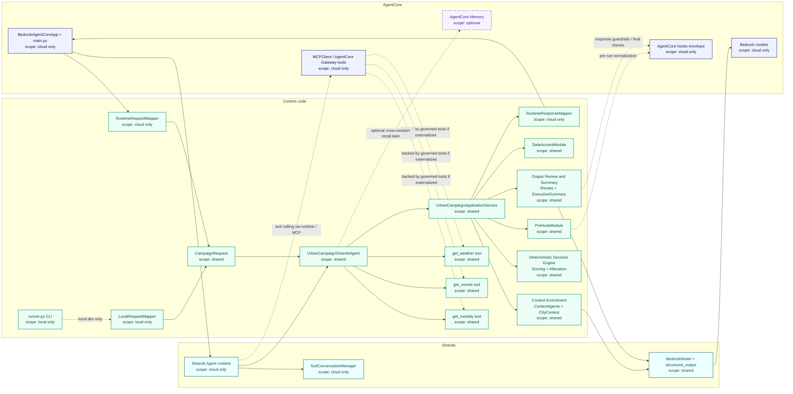

# Mapping runtime — composants et frontières

Ce document descend d'un cran sous [../ARCHITECTURE.md](../ARCHITECTURE.md) §5.2 : là où le DAT
décrit des **rôles**, celui-ci mappe les **fichiers et classes réels** du projet sur la frontière
AgentCore / Strands / code métier.

Il répond à une seule question : *pour chaque brique du code, qui la gouverne et où s'exécute-t-elle ?*

| Pour… | Voir |
| --- | --- |
| l'architecture cible et les décisions | [../ARCHITECTURE.md](../ARCHITECTURE.md) |
| l'état d'avancement réel | [STATUS.md](STATUS.md) |
| le choix « option 2 » | [DECISIONS.md](DECISIONS.md) ADR-006 |
| le choix du fournisseur de modèles | [DECISIONS.md](DECISIONS.md) ADR-007 |

## Règle de lecture

Le schéma ci-dessous décrit la **cible**. L'agent y appelle réellement les tools, et les tools y sont
de vraies surfaces gouvernées. Ce n'est pas encore l'état du code — voir [STATUS.md](STATUS.md).

L'accès modèle passe par le **SDK Strands** : `llm_client.StrandsBedrockClient` enveloppe
`BedrockModel` (transport Converse) et `Agent.structured_output` (extraction contrainte par les
schémas Pydantic de `llm_schemas.py`). `OpenRouterClient` reste un repli local transitoire, hors
cible (ADR-007).

## Légende

Blocs :

- **`AgentCore`** : enveloppe runtime et surfaces cloud gouvernées par la plateforme
- **`Strands`** : boucle agentique et orchestration
- **`Custom code`** : logique portée par le code du projet

Couleurs : bleu = `AgentCore`, cyan = `Strands`, vert = code projet, violet pointillé = optionnel.

Scope porté par les labels : `local only`, `shared`, `cloud only`, `optional`.

## Vue intégrée

### Lecture rapide

| Question | Réponse |
| --- | --- |
| Qu'est-ce qui est **local seulement** ? | [runner.py](../src/urban_campaign_intelligence/runner.py), `LocalRequestMapper` |
| Qu'est-ce qui est **partagé** local / cloud ? | `CampaignRequest`, `UrbanCampaignStrandsAgent`, `UrbanCampaignApplicationService`, les 4 blocs métier, la couche providers |
| Qu'apportent **AgentCore et Strands** ? | `BedrockAgentCoreApp + main.py`, `Strands Agent runtime`, **`BedrockModel` + `structured_output`**, les mappers runtime, `MCPClient / Gateway`, `Memory` plus tard |

Le métier reste dans le code du projet. AgentCore apporte l'enveloppe runtime, le tool calling et
les points d'extension cloud. **Strands porte la boucle agentique et l'accès modèle** — depuis la
migration, aucun appel LLM ne part du code projet sans passer par `BedrockModel`. Ce que Strands ne
porte pas : la logique métier critique, et la cascade de repli vers l'heuristique déterministe.

### Détail regroupé dans le schéma

| Bloc du schéma | Composants réels |
| --- | --- |
| `Context Enrichment` | `ContextAgentsModule`, `CityContextModule` |
| accès modèle | `StrandsBedrockClient` → `strands.models.BedrockModel` + `Agent.structured_output` |
| contrats de sortie LLM | `llm_schemas.py` : `EventClassification`, `AllocationReview`, `ExecutiveSummary` |
| `Deterministic Decision Engine` | `ScoringModule`, allocation métier |
| `Output Review and Summary` | `ReviewModule`, `ExecutiveSummaryModule` |
| `get_weather tool` | `MockGatewayProvider`, `OpenMeteoWeatherProvider` |
| `get_events tool` | `GatewayProvider`, `ParisOpenDataEventsProvider` |
| `get_mobility tool` | `GatewayProvider`, `MobilityForecastProvider` |

## Qui contrôle quoi

| Zone | Contrôlé par | Rôle | Observable par défaut | Permissions |
|---|---|---|---|---|
| Runtime entrypoint | AgentCore | recevoir la requête, exécuter le runtime, propager l'identité | oui | IAM du runtime |
| Strands agent loop | Strands | orchestration, choix d'appels, tool calling, prompt | partiellement | héritées du runtime + accès tools |
| Tools externalisés | AgentCore Gateway / MCP | accès gouverné aux sources externes | oui | auth tool par tool |
| Providers inline | code projet | accès direct aux providers Python | seulement si loggué explicitement | permissions du runtime |
| PreHookModule | code projet | validation, normalisation, `time_context` | seulement si loggué explicitement | aucune |
| CityContext / scoring / allocation | code projet | logique métier déterministe | seulement si loggué explicitement | aucune |
| Appels LLM | **Strands `BedrockModel`** sur Bedrock | classification, review, executive summary | oui, côté appels modèle | `bedrock:InvokeModel` |
| Memory | AgentCore Memory | rappel cross-session | oui | droits Memory dédiés |

### Conséquence sur l'observabilité

Ce tableau est ce qui justifie le chapitre 11 du DAT.

**Visible automatiquement** dès qu'on passe par AgentCore / Bedrock / Gateway : entrée runtime,
identité IAM, session et `run_id`, appels modèle, tokens consommés, appels Gateway / MCP, logs runtime.

**Non visible automatiquement** tant que le traitement reste un appel Python interne :
`build_city_context()`, le calcul de scoring, les branches d'allocation, les validations de review.

Une lecture fine du workflow impose donc une **trace applicative structurée** côté projet, en
complément de ce qu'AgentCore fournit. Plus une capacité est externalisée derrière une surface
AgentCore — runtime, appel modèle, tool, memory — plus elle devient observable et gouvernable.

## Cas particulier : `PreHookModule`

`PreHookModule` n'est **pas** un hook natif AgentCore, c'est un pré-traitement métier local.

Son rôle : valider l'entrée, normaliser la datetime, dériver le `time_slot`, construire le
`time_context`, initialiser les métadonnées du pipeline.

Le lien avec AgentCore est conceptuel — il joue la préparation du run — mais il n'est pas gouverné
par la plateforme comme l'est un tool ou un appel modèle.

## Fourni vs à écrire

### Fourni par le squelette AgentCore / Strands

`BedrockAgentCoreApp`, l'entrypoint runtime, `Agent`, `NullConversationManager`, le support MCP / tools.

### Présent dans le projet

[local_agent.py](../src/urban_campaign_intelligence/local_agent.py) ·
[app_service.py](../src/urban_campaign_intelligence/app_service.py) ·
[gateway_tools.py](../src/urban_campaign_intelligence/gateway_tools.py) ·
[context_agents.py](../src/urban_campaign_intelligence/context_agents.py) ·
[pre_hook.py](../src/urban_campaign_intelligence/pre_hook.py) ·
[city_context.py](../src/urban_campaign_intelligence/city_context.py) ·
[scoring.py](../src/urban_campaign_intelligence/scoring.py) ·
[review.py](../src/urban_campaign_intelligence/review.py) ·
[executive_summary.py](../src/urban_campaign_intelligence/executive_summary.py) ·
[data_access.py](../src/urban_campaign_intelligence/data_access.py)

Côté structure : une façade `UrbanCampaignStrandsAgent`, un contrat `CampaignRequest`, un mapper
local `LocalRequestMapper`, une couche service `UrbanCampaignApplicationService`.

### À écrire pour matérialiser la cible

- transformer `UrbanCampaignStrandsAgent` en agent Strands complet
- `RuntimeRequestMapper` et `RuntimeResponseMapper`
- le wiring runtime remplaçant l'agent générique par l'agent métier
- le passage de `get_weather`, `get_events`, `get_mobility` vers de vrais tools gouvernés
- `AgentCore Memory` si un usage concret le justifie

L'ordonnancement de ces chantiers est dans [../ARCHITECTURE.md](../ARCHITECTURE.md) §12.2.
