# Status

run_id=run_b465ff2985d5 mode=scenario steps=13 duration=1.7 ms tokens=None

Le gantt agrège les steps par composant (une barre par composant) pour rester lisible ; le log
d'exécution conserve, lui, le détail step par step. En mode `prompt`, une barre
`UrbanCampaignStrandsAgent` en tête de `Input` porte la latence de l'orchestration (round-trip agent).

```mermaid
gantt
    title Run run_b465ff2985d5 — 1.7 ms total (axis in us)
    dateFormat x
    axisFormat %L
    todayMarker off
    section Input
    PreHook 26us :0, 26
    section Context
    GatewayProvider 93us :26, 119
    ContextAgents 76us :119, 195
    CityContextBuilder 27us :195, 222
    section Decision
    ScoringEngine 1414us :222, 1636
    section Output
    ReviewAgent 33us :1636, 1669
    ExecutiveSummary 27us :1669, 1696
```

## Objectif

Suivre l'avancement opérationnel du projet avec un niveau de granularité plus fin que la roadmap.

Règle d'usage :

- `roadmap.md` = vision, lots, ordre d'exécution
- `docs/STATUS.md` = état réel, tâches terminées, tâches en cours, prochains pas

---

## Légende

- `done` : terminé
- `in_progress` : en cours
- `next` : prochaine action prioritaire
- `blocked` : bloqué
- `todo` : non démarré

---

## Snapshot

| Domaine | Statut | Commentaire |
|---|---|---|
| Cadrage produit | `done` | PRD, roadmap et scope MVP stabilisés |
| Documentation architecture | `done` | schémas Mermaid et architecture hybride en place |
| Données MVP | `done` | 20 zones, 5 annonceurs, 8 scénarios |
| Moteur local | `done` | pipeline local exécutable de bout en bout |
| Tests locaux | `done` | smoke tests en place |
| Multi-LLM réel | `done` | workflow multi-LLM validé en exécution réelle via OpenRouter avec fallback conservé |
| Multi-events reasoning | `done` | influence événementielle agrégée par zone implémentée |
| Gateway tools contract | `done` | contrats mockés formalisés et branchés localement |
| Weather semi-real backend | `done` | `Open-Meteo` branché avec fallback mock |
| Events semi-real backend | `done` | Paris Open Data branché avec fallback mock |
| Mobility forecast backend | `done` | forecast déterministe `hour_of_week` branché |
| AgentCore orchestration | `done` | mode `prompt` réellement agentique **sur le runtime déployé** : un agent Strands (Nova Lite / Bedrock) interprète le prompt et décide des tool calls (`orchestrator.py`), puis le pipeline déterministe score (ADR-002). Reste à câbler : la surface Gateway |
| Accès modèle Bedrock | `done` | débloqué au niveau compte ; Nova Lite validé pour le tool use (fiable en one-shot), y compris **depuis le rôle d'exécution du runtime** |
| Déploiement AWS | `done` | runtime AgentCore déployé (stack `AgentCore-UrbanCampaignIntelPoc-default`) ; verticale fermée par un vrai `InvokeAgentRuntime` (prompt Nike → reco). Le blocage n'était pas `maxAgents` mais le compte cible placeholder (`aws-targets.json`) + le packaging PO-7 |

---

## Avancement détaillé

## 1. Cadrage et documentation

| Élément | Statut | Notes |
|---|---|---|
| `AGENTS.md` | `done` | règles projet, objectif portfolio, contraintes |
| `docs/archive/2026-07-cadrage-prd-mvp.md` | `archivé` | cadrage initial, remplacé par le DAT |
| `roadmap.md` | `done` | stratégie d'exécution et lots définis |
| `ARCHITECTURE.md` | `done` | workflow, data model, reasoning, decision split |
| `docs/DECISIONS.md` | `done` | ADRs MVP en place |
| `README.md` | `done` | version française et état réel du repo |

### Prochaine action

- `done` : ajouter une courte section "Known limitations" dans `README.md`
- `done` : ajouter un index documentaire léger pour distinguer docs canoniques, docs de delivery et docs d'audit
- `next` : alléger progressivement `README.md` si la doc AWS détaillée continue de grossir

---

## 2. Données

| Élément | Statut | Notes |
|---|---|---|
| `data/zones.json` | `done` | 20 zones cohérentes et diversifiées |
| `data/advertisers.json` | `done` | 5 annonceurs réalistes et variés |
| `data/scenarios.json` | `done` | scénarios fake explicites et plus riches, dont un scénario multi-events |
| `tools/scoring_weights.json` | `done` | pondérations initiales présentes |
| Backend météo semi-réel | `done` | `Open-Meteo` + fallback mock |
| Backend événements semi-réel | `done` | Paris Open Data + fallback mock |
| Contrats Gateway mockés | `done` | formalisés et versionnés |
| Contrats Gateway externes | `done` | météo et événements branchés, mobilité forecast stabilisé |

### Prochaine action

- `done` : remplacer un premier backend mock par une source semi-réelle tout en gardant le même contrat
- `done` : appliquer le même pattern à `events`
- `done` : appliquer le même pattern à `mobility`

---

## 3. Moteur local

| Composant | Statut | Fichier |
|---|---|---|
| Pre-hook | `done` | `src/urban_campaign_intelligence/pre_hook.py` |
| Weather Agent | `done` | `src/urban_campaign_intelligence/context_agents.py` |
| Events Agent | `done` | `src/urban_campaign_intelligence/context_agents.py` |
| Mobility Agent | `done` | `src/urban_campaign_intelligence/context_agents.py` |
| CityContext Builder | `done` | `src/urban_campaign_intelligence/city_context.py` |
| Zone Analyzer Agent | `done` | `src/urban_campaign_intelligence/scoring.py` |
| Advertiser Matcher Agent | `done` | `src/urban_campaign_intelligence/scoring.py` |
| Campaign Allocator Agent | `done` | `src/urban_campaign_intelligence/scoring.py` |
| Review Agent | `done` | `src/urban_campaign_intelligence/review.py` |
| Executive Summary Agent | `done` | `src/urban_campaign_intelligence/runner.py` |
| CLI runner | `done` | `src/urban_campaign_intelligence/runner.py` |

### Limites actuelles

- tous les agents ne sont pas encore supportés par modèle
- `Events Agent`, `Review Agent` et `Executive Summary` supportent désormais un mode `llm` avec fallback heuristique
- la météo et les événements disposent d'une intégration réseau semi-réelle
- le multi-events reasoning reste volontairement heuristique
- le matching annonceur reste encore trop déterministe sur certains cas concert / sport

### Prochaines actions

- `done` : formaliser les interfaces tools pour découpler collecte et interprétation
- `done` : choisir un premier agent à brancher sur un vrai modèle
- `done` : remplacer le bonus événement binaire par une influence agrégée multi-events par zone
- `done` : tester réellement le workflow multi-LLM avec OpenRouter
- `deferred` : affiner ou confirmer davantage le comportement multi-LLM sur d'autres scénarios
- `done` : améliorer la diversité par annonceur dans l'allocateur

---

## 4. Tests et qualité

| Élément | Statut | Notes |
|---|---|---|
| Smoke tests | `done` | `tests/test_runner.py` |
| Validation JSON | `done` | fichiers JSON chargés avec succès |
| Régression scénarios | `in_progress` | couverture encore faible mais scénario multi-events ajouté |
| Assertions métier détaillées | `done` | assertions clés ajoutées sur luxe, sport, chaleur et départ vacances |
| Harness d'évaluation | `todo` | non démarré |

### Prochaine action

- `next` : ajouter un premier harness d'évaluation léger pour comparer quelques scénarios attendus

---

## 5. Intégration AWS / AgentCore

| Élément | Statut | Notes |
|---|---|---|
| `bootstrap.sh` | `done` | vérifie les prérequis Lot 2 (`aws`, `agentcore`, `node`, région, identité AWS, projet AgentCore cible) et peut exécuter les tests locaux |
| `demo.sh` | `done` | lance les scénarios locaux |
| Cadrage infra MVP | `done` | cible `InvokeAgentRuntime + AgentCore Runtime + Strands agent métier + Gateway-first security model`, documentée |
| Verticale locale fermée | `done` | entrypoint **canonique** `app/…/main.py` branché sur le pipeline métier (package installable, `pip install -e .`) ; `POST /invocations` → 200, `/ping` → 200 (validé ASGI in-process). `handle_invocation` dans `urban_campaign_intelligence.invocation`, testé. 45 tests verts (1 skippé : l'intégration agent → Bedrock → tools, gated par `AGENTCAMPAIGN_RUN_LLM_TESTS=1`) |
| Packaging déploiement (CodeZip) | `done` | PO-7 résolu : `deploy.sh` stage le package `urban_campaign_intelligence` (pur Python) + `data/` + `tools/scoring_weights.json` dans `codeLocation` au build ; `data_access` résout ses chemins pour le layout conteneur (`/var/task`). Prouvé dans le runtime déployé (imports + data OK) |
| Agent Strands réel (mode `prompt`) | `done` | `orchestrator.py` : un `strands.Agent` sur Nova Lite (Bedrock) expose `get_weather`/`get_events`/`get_mobility` en `@tool`, extrait ville/datetime du prompt et décide des appels ; un collecteur capte les signaux, puis le pipeline déterministe score. **Validé sur le runtime AWS déployé** (agent → Bedrock → tools). Nova Lite retenu (Gemma rejeté, tool use non fiable) |
| Routage `prompt` dans le runtime déployé | `done` | `InvokeAgentRuntime` est prompt-first ; un prompt NL (« Plan a Nike ad campaign in Paris this Saturday ») a traversé `from_dict` → `run_prompt_request` → agent → pipeline et renvoyé une reco focus Nike, sur le runtime déployé |
| `deploy.sh` | `done` | déploiement réel réussi : bootstrap CDK OK, bucket S3 durci, staging package+data (PO-7), `agentcore deploy` → runtime créé, `agentcore status` déployé. Premier échec dû au compte cible placeholder dans `aws-targets.json`, corrigé |
| `destroy.sh` | `in_progress` | teardown AgentCore/CDK + nettoyage S3 pilotés par `deploy-outputs.json` ou le manifeste |
| AgentCore Gateway | `done` | les 3 context tools (`get_weather`/`get_events`/`get_mobility`) sont exposés en **MCP** derrière une Lambda gouvernée (`agentcore.json` → CDK). L'agent les consomme via MCP+SigV4 (`gateway_mcp.py` + `orchestrator.py`), un hook `AfterToolCallEvent` capte les résultats. Validé sur le runtime déployé (logs Lambda : `contextTools___get_weather/...`) |
| Guardrails / Policy Gateway | `todo` | non démarré (surface Gateway maintenant en place pour les accueillir) |
| Bedrock model mapping | `todo` | non démarré |
| Hooks AWS réels | `todo` | non démarré |

### Prochaine action

- `done` : cadrer la cible infra MVP du Lot 2
- `done` : implémenter `deploy.sh` sur la cible AWS documentée
- `done` : sécuriser le bucket S3 et réordonner la validation AgentCore dans `deploy.sh`
- `done` : consolider le repo autour d'un seul projet AgentCore cible dédié
- `in_progress` : implémenter `destroy.sh` sur la même base
- `done` : remplacer le pipeline déterministe par un **agent Strands réel** qui décide des tool calls (mode `prompt`, sur Bedrock)
- `done` : brancher cet agent Strands sur le noyau métier déterministe existant (l'agent orchestre l'entrée, le scoring reste hors agent — ADR-002)
- `done` : router le mode `prompt` dans le runtime AgentCore déployé et fermer un `InvokeAgentRuntime` réel
- `next` : brancher `AgentCore Gateway` sur `get_weather`, `get_events`, `get_mobility`
- `next` : attacher `Policy` et `Bedrock Guardrails` à cette surface Gateway
- `next` : skills review (compliance + allocation-quality) adossées à un Knowledge Base, puis publier tools/agent/skills au `Registry`
- `next` : corriger l'export OTEL (400 Bad Request sur l'endpoint de traces du runtime)

---

## 6. Priorités immédiates

### Now

- `done` : brancher `AgentCore Gateway` sur les 3 tools — l'agent les consomme via MCP+SigV4
- attacher `Policy` / `Bedrock Guardrails` à la surface Gateway (maintenant en place)
- skills review (compliance + allocation-quality) + Knowledge Base, puis `Registry`
- `done` : verticale AWS fermée — `InvokeAgentRuntime` → runtime déployé → agent Nova Lite → pipeline → reco
- `done` : tracer la latence de l'orchestration Strands — la `RunTrace` démarre désormais dans `run_prompt_request` et porte une étape `orchestrator_agent` (durée + tokens du round-trip agent) en tête du log

### Next

- router le mode `prompt` dans le runtime AgentCore déployé et fermer un `InvokeAgentRuntime` réel
- brancher `AgentCore Gateway` sur `get_weather`, `get_events`, `get_mobility`
- attacher `Policy` et `Bedrock Guardrails` à cette surface
- ajouter un premier harness d'évaluation léger
- observer le comportement `forecast` sur plusieurs scénarios
- préparer le prochain retry de déploiement une fois le quota relevé

### Later

- brancher AgentCore Gateway
- activer Guardrails / Policy sur Gateway
- brancher Bedrock
- finaliser un smoke test signé sur `API Gateway + AWS_IAM` seulement si cette façade HTTP est retenue

---

## Valeur ajoutée différée

Éléments utiles mais volontairement non implémentés à ce stade :

- géolocalisation réelle des événements avec rayon d'impact calculé
- fenêtres `start/end` exploitées finement au lieu d'une logique par `time_slot`
- source mobilité semi-réelle ou réelle
- vrai système de prévision trafic au-delà du simple profil `hour_of_week`
- passe de `post-review deterministic rebalancing` déclenchée par saturation ou faible diversité
- mémoire inter-run ou comparaison entre scénarios
- observabilité agentique plus riche avec traces structurées
- évaluation métier systématique des recommandations

---

## Définition de "done" par lot

## Lot 1

Considéré comme `done` quand :

- le moteur local couvre tous les scénarios MVP
- les justifications sont cohérentes
- les assertions métier minimales sont en place
- au moins une première intégration LLM a été décidée ou câblée proprement

État courant :

- moteur local : `done`
- justifications cohérentes : `done`
- assertions métier minimales : `done`
- première intégration LLM câblée et testée : `done`
- clôture formelle du lot : `done`

## Lot 2

Considéré comme `done` quand :

- les tools Gateway sont définis
- le workflow AgentCore est câblé
- le déploiement AWS est faisable sans bricolage manuel important

État courant :

- bootstrap CDK réel : `done`
- agent Strands réel décidant les tool calls (mode `prompt`, sur Bedrock) : `done`
- accès modèle Bedrock : `done` (Nova Lite validé, y compris depuis le rôle runtime)
- packaging CodeZip (PO-7) : `done`
- déploiement live réel : `done` — runtime déployé, `InvokeAgentRuntime` fermé de bout en bout
- Lot 2 : **`done`** (les vrais blocages étaient le compte cible placeholder + le packaging, pas le quota `maxAgents`)

---

## Mise à jour

À mettre à jour après chaque changement significatif sur :

- architecture
- moteur local
- contrats tools
- intégration AWS
- tests
