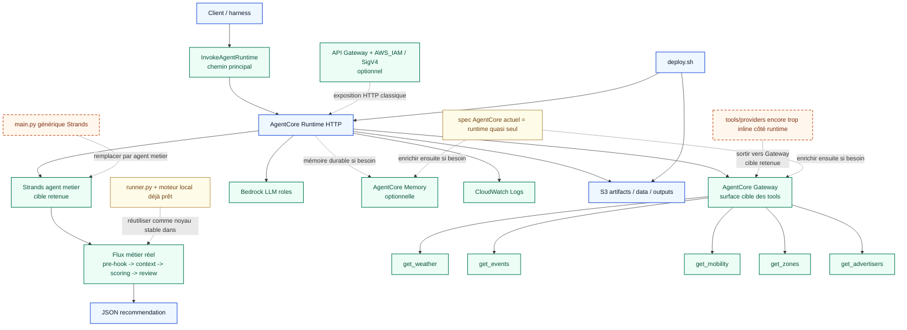

# Archive — Existant AWS vs cible AWS

> **Document archivé.** Il a servi à cadrer le chantier Lot 2.
> La synthèse de l'écart est désormais dans [../../ARCHITECTURE.md](../../ARCHITECTURE.md) §12,
> l'état réel dans [../STATUS.md](../STATUS.md).
>
> Conservé pour le diagramme de transformation existant → cible et le tableau de delta.
> **Les sections d'état d'implémentation sont figées au 2026-07 et ne font pas foi.**

---

## Objectif

Rendre visible, en une seule vue, la différence entre :

- l'**état actuel réellement exécutable**
- la **cible AWS agentique** voulue pour le MVP portfolio

Ce document sert à cadrer le chantier Lot 2 et à éviter deux confusions :

1. croire que le runtime AWS actuel exécute déjà le vrai flux métier
2. croire que toutes les briques différenciantes AgentCore annoncées sont déjà matérialisées

---

## Vue unique : transformation de l'existant vers la cible

---

## Lecture du schéma

### Légende

- **bleu** : bloc déjà présent et conservé dans la cible
- **vert** : bloc à ajouter pour atteindre la cible
- **orange pointillé** : bloc actuel à remplacer ou à sortir ailleurs

### Ce qui existe déjà vraiment

- le **moteur métier local** fonctionne de bout en bout
- les **providers / contrats tools** sont déjà stabilisés côté local
- le **socle de déploiement AWS** existe (`deploy.sh`, projet AgentCore, bucket S3, artefacts)

### Ce qui manque encore

- le **runtime AgentCore AWS** doit encore héberger un vrai **Strands agent métier**
- le **Gateway AgentCore** doit encore être matérialisé pour porter les tools, les policies et les guardrails
- la **Memory AgentCore** doit encore être matérialisée dans le spec
- le chemin **InvokeAgentRuntime -> Strands agent métier -> runtime métier réel** n'est pas encore fermé de bout en bout
- le chemin **API Gateway + AWS_IAM + smoke test signé** reste optionnel et non fermé

---

## Delta exact à combler

| Couche | Existant | Cible | Écart |
|---|---|---|---|
| Runtime AWS | `main.py` template générique | Strands agent métier réel | majeur |
| Flux métier AWS | non branché dans AgentCore | pre-hook -> context -> scoring -> review | majeur |
| Invocation AWS | chemin direct non démontré | `InvokeAgentRuntime` sur le vrai Strands agent métier | majeur |
| AgentCore Gateway | absent du flux réel | tools exposés via Gateway avec Policy / Guardrails | majeur |
| Bedrock métier | surtout documenté | utilisé par les rôles LLM AWS | moyen |
| Memory | documentée | branchée si usage concret | moyen |
| Harness | non branché sur le runtime final | même cible que la démo | moyen |
| Endpoint signé | pas encore démontré | `API Gateway + AWS_IAM + SigV4` si exposition HTTP requise | moyen |
| Observabilité | intentionnelle | logs/traces utiles et actionnables | moyen |

---

## Ordre de construction recommandé

Le chemin de fermeture le plus cohérent vers la cible est :

1. **remplacer le runtime template** par un runtime AgentCore qui héberge un vrai **Strands agent métier**
2. **brancher cet agent** sur le noyau métier déterministe déjà existant
3. **fermer l'invocation directe** du runtime avec un premier smoke test `InvokeAgentRuntime`
4. **matérialiser `AgentCore Gateway`** pour y porter les tools de contexte
5. **attacher Guardrails + Policy** sur cette surface Gateway
6. ajouter ensuite **API Gateway + AWS_IAM + SigV4** seulement si un endpoint HTTP classique est nécessaire
7. ajouter **harness**
8. ajouter **Memory** seulement si la démonstration métier du précédent inter-run est réellement utilisée

---

## État d'implémentation du chantier

Cette section sert de repère opérationnel pendant le Lot 2.

### Déjà implémenté

- **moteur métier local complet**
  - `pre_hook`
  - construction de contexte
  - scoring déterministe
  - review
  - sortie JSON
- **mode scénario local**
  - basé sur `data/scenarios.json`
  - utile pour replay, debug et tests
- **providers et contrats tools côté local**
  - météo
  - événements
  - mobilité
  - zones
  - annonceurs
- **socle de déploiement AWS**
  - `deploy.sh`
  - projet AgentCore cible
  - bucket S3 et artefacts

### En cours d'implémentation

- **alignement du runtime AgentCore avec la cible option 2**
  - objectif : remplacer le `main.py` template générique
  - cible : un runtime AgentCore qui héberge un **Strands agent métier**
  - contrainte : conserver le scoring, l'allocation et la review critique hors du prompt principal
- **gateway-first security model**
  - objectif : faire passer les tools de contexte derrière `AgentCore Gateway`
  - cible : `Policy + Guardrails + auth tool-level` sur cette surface
  - contrainte : réserver les hooks custom aux règles métier et à la readiness des données
- **wiring AWS du mode live**
  - les contrats `get_*` sont maintenant utilisés en mode `live` local
  - il reste à faire exécuter ce même chemin via le runtime AgentCore AWS

### Prochaine implémentation immédiate

1. créer le **Strands agent métier** dans le projet AgentCore
2. vérifier le packaging/import du noyau métier dans le projet AgentCore
3. brancher cet agent sur `app_service.py` et les modules déterministes existants
4. fermer un premier smoke test AWS sur le mode `live` via `InvokeAgentRuntime`
5. matérialiser `AgentCore Gateway` et y brancher `get_weather`, `get_events`, `get_mobility`
6. attacher `Policy` et `Guardrails` sur cette surface
7. n'ajouter `API Gateway + AWS_IAM` qu'en cas de besoin d'exposition HTTP classique

### Pas encore implémenté

- **Strands agent métier réel dans AgentCore**
- **mode live AgentCore basé sur les `get_*`**
- **AgentCore Gateway**
- **AgentCore Memory**
- **invocation directe `InvokeAgentRuntime` démontrée de bout en bout sur la cible option 2**
- **endpoint `API Gateway + AWS_IAM + SigV4` démontré de bout en bout si retenu**
- **harness AWS branché sur la même cible finale**

### Désormais implémenté dans le moteur local

- **service applicatif partagé**
  - `src/urban_campaign_intelligence/app_service.py`
  - point d'entrée unique pour `scenario` et `live`
- **mode `scenario` simplifié**
  - injection directe depuis `data/scenarios.json`
  - bypass volontaire des `get_weather`, `get_events`, `get_mobility`
  - utile pour replay déterministe, debug et tests
- **mode `live` local**
  - entrée par `datetime`
  - ville fixée à `Paris`
  - usage réel des `get_weather`, `get_events`, `get_mobility`
- **CLI réalignée sur ce contrat**
  - `--scenario` pour le replay
  - `--datetime` pour le mode live
- **tests de non-régression**
  - validation du bypass `scenario`
  - validation du mode `live`
  - validation de la contrainte `Paris` côté live

### Règle de lecture

Tant que cette section n'indique pas explicitement qu'un élément est `implémenté`, il doit être considéré comme :

- soit **encore local seulement**
- soit **documenté mais non matérialisé dans la cible AWS**

---

## Conséquence pratique

Le chantier n'est pas :

- "reconstruire tout le projet sur AWS"

Le vrai chantier est :

- **faire converger le runtime AWS vers un Strands agent métier crédible**
- **faire converger ce Strands agent vers le moteur métier déterministe existant**
- **faire converger le spec AgentCore vers les briques différenciantes réellement utiles**
- **faire porter la sécurité générique des tools par Gateway / Policy / Guardrails**

En une phrase :

> aujourd'hui, AWS déploie surtout une coque AgentCore ; la cible est maintenant qu'AgentCore Runtime héberge un vrai Strands agent métier branché sur le cerveau déterministe du MVP, avec les tools gouvernés via Gateway / Policy / Guardrails, puis une façade HTTP seulement si cela sert la démo.
